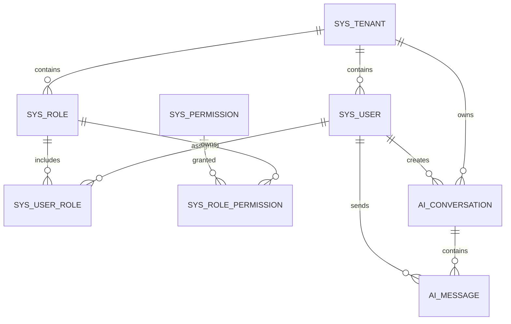

# 数据库设计说明书

## 1. 文档说明

本文档用于定义 Enterprise AI Platform 第一迭代的数据库结构、表关系、索引、约束和数据隔离规范。

第一迭代主要支撑以下业务：

- 多租户基础能力
- 用户登录与身份认证
- 用户、角色和权限管理
- AI 会话管理
- AI 消息记录
- AI 模型调用结果记录

本文档对应以下服务：

| 服务              | 数据库     | 主要职责                 |
| ----------------- | ---------- | ------------------------ |
| `user-service`    | `eap_user` | 租户、用户、角色和权限   |
| `ai-service`      | `eap_ai`   | AI 会话和消息记录        |
| `auth-service`    | 不单独建库 | 调用用户服务完成认证     |
| `gateway-service` | 不单独建库 | 路由、令牌校验和身份传递 |

------

## 2. 数据库设计原则

### 2.1 服务独占数据库

每个微服务只能直接访问自己负责的数据库。

例如：

- `user-service` 只能直接访问 `eap_user`
- `ai-service` 只能直接访问 `eap_ai`
- `ai-service` 不能直接查询 `sys_user`
- 用户信息必须通过 `user-service` 接口获取

这样可以避免服务之间通过数据库表形成强耦合。

------

### 2.2 不使用跨服务外键

数据库不建立跨微服务外键。

`ai_conversation.user_id` 和 `ai_message.user_id` 只保存用户编号，不建立到 `sys_user.id` 的数据库外键。

原因：

1. 不同服务的数据可能位于不同数据库。
2. 外键会阻碍数据库拆分和数据迁移。
3. 服务之间的数据一致性由业务逻辑保证。
4. 删除用户时不能直接级联删除其 AI 数据。
5. 后续可以通过消息事件完成跨服务数据同步。

------

### 2.3 主键生成策略

所有业务表主键统一使用：

```text
BIGINT
```

Java 实体类使用：

```text
Long
```

第一阶段建议使用 MyBatis-Plus 的：

```text
IdType.ASSIGN_ID
```

底层使用分布式编号算法生成主键。

不优先使用数据库自增主键，原因包括：

- 多实例部署时更方便
- 后续分库分表时不容易冲突
- 数据迁移和合并更简单
- 插入数据库前即可获得业务编号

本地初始化数据可以使用较小的固定编号，生产环境使用分布式编号。

------

### 2.4 时间字段规范

所有时间字段统一使用：

```text
DATETIME(3)
```

保存毫秒精度。

数据库连接、Java 应用和容器环境统一设置时区，接口层统一返回 ISO 8601 格式。

示例：

```text
2026-07-22T15:30:00+08:00
```

------

### 2.5 逻辑删除规范

核心业务表统一包含：

```text
deleted TINYINT NOT NULL DEFAULT 0
```

取值：

| 值   | 说明   |
| ---- | ------ |
| `0`  | 未删除 |
| `1`  | 已删除 |

普通查询必须自动追加：

```sql
deleted = 0
```

第一迭代不直接物理删除核心业务数据。

------

### 2.6 乐观锁规范

可能被多人同时修改的表增加：

```text
version INT NOT NULL DEFAULT 0
```

更新时使用：

```sql
UPDATE table_name
SET field = ?,
    version = version + 1
WHERE id = ?
  AND version = ?;
```

如果受影响行数为零，说明数据已被其他请求修改。

------

### 2.7 审计字段规范

核心业务表统一保留以下字段：

```text
created_by
created_at
updated_by
updated_at
```

用途：

- 记录数据创建人
- 记录最后修改人
- 支持后台审计
- 支持问题排查
- 支持数据变更追踪

------

### 2.8 多租户隔离规范

租户业务表必须包含：

```text
tenant_id BIGINT NOT NULL
```

所有租户业务查询必须包含：

```sql
tenant_id = ?
```

禁止只根据业务主键查询数据。

错误示例：

```sql
SELECT *
FROM sys_user
WHERE id = ?;
```

正确示例：

```sql
SELECT *
FROM sys_user
WHERE tenant_id = ?
  AND id = ?
  AND deleted = 0;
```

即使主键全局唯一，也必须保留租户条件，避免代码修改或权限漏洞导致越权访问。

------

## 3. 数据库和表清单

### 3.1 用户服务数据库

数据库名称：

```text
eap_user
```

包含以下表：

| 表名                  | 说明           |
| --------------------- | -------------- |
| `sys_tenant`          | 租户表         |
| `sys_user`            | 用户表         |
| `sys_role`            | 角色表         |
| `sys_permission`      | 权限表         |
| `sys_user_role`       | 用户角色关联表 |
| `sys_role_permission` | 角色权限关联表 |

------

### 3.2 AI 服务数据库

数据库名称：

```text
eap_ai
```

包含以下表：

| 表名              | 说明      |
| ----------------- | --------- |
| `ai_conversation` | AI 会话表 |
| `ai_message`      | AI 消息表 |

------

## 4. 数据库初始化

```sql
CREATE DATABASE IF NOT EXISTS eap_user
    DEFAULT CHARACTER SET utf8mb4
    COLLATE utf8mb4_unicode_ci;

CREATE DATABASE IF NOT EXISTS eap_ai
    DEFAULT CHARACTER SET utf8mb4
    COLLATE utf8mb4_unicode_ci;
```

字符集使用 `utf8mb4`，以支持中文、Emoji 和其他完整 Unicode 字符。

------

## 5. 表关系设计



说明：

- 图中表示的是逻辑业务关系。
- 用户服务表和 AI 服务表之间不创建数据库外键。
- `tenant_id` 用于数据隔离。
- `user_id` 用于记录数据归属。
- 一个用户可以拥有多个角色。
- 一个角色可以拥有多个权限。
- 一个会话可以包含多条消息。

------

# 6. 用户服务表设计

## 6.1 租户表 sys_tenant

### 6.1.1 表说明

`sys_tenant` 用于保存企业或组织租户信息。

第一迭代只初始化一个默认租户，但数据库从开始就保留多租户结构。

### 6.1.2 建表语句

```sql
USE eap_user;

CREATE TABLE sys_tenant (
    id              BIGINT          NOT NULL COMMENT '租户主键',
    tenant_code     VARCHAR(50)     NOT NULL COMMENT '租户编码',
    tenant_name     VARCHAR(100)    NOT NULL COMMENT '租户名称',
    status          TINYINT         NOT NULL DEFAULT 1 COMMENT '状态：0-禁用，1-启用',
    contact_name    VARCHAR(50)              COMMENT '联系人姓名',
    contact_email   VARCHAR(100)             COMMENT '联系人邮箱',
    expire_time     DATETIME(3)              COMMENT '租户到期时间',
    version         INT             NOT NULL DEFAULT 0 COMMENT '乐观锁版本号',
    deleted         TINYINT         NOT NULL DEFAULT 0 COMMENT '逻辑删除：0-未删除，1-已删除',
    created_by      BIGINT                   COMMENT '创建人编号',
    created_at      DATETIME(3)     NOT NULL DEFAULT CURRENT_TIMESTAMP(3) COMMENT '创建时间',
    updated_by      BIGINT                   COMMENT '更新人编号',
    updated_at      DATETIME(3)     NOT NULL DEFAULT CURRENT_TIMESTAMP(3)
                                    ON UPDATE CURRENT_TIMESTAMP(3) COMMENT '更新时间',
    PRIMARY KEY (id),
    UNIQUE KEY uk_tenant_code (tenant_code),
    KEY idx_tenant_status_deleted (status, deleted)
) ENGINE=InnoDB
  DEFAULT CHARSET=utf8mb4
  COLLATE=utf8mb4_unicode_ci
  COMMENT='租户表';
```

### 6.1.3 索引说明

| 索引                        | 作用               |
| --------------------------- | ------------------ |
| `PRIMARY KEY (id)`          | 根据租户编号查询   |
| `uk_tenant_code`            | 保证租户编码唯一   |
| `idx_tenant_status_deleted` | 查询启用或禁用租户 |

### 6.1.4 设计说明

1. `tenant_code` 用于登录时识别租户。
2. `tenant_code` 创建后原则上不允许修改。
3. 禁用租户后，租户下所有用户都不能登录。
4. `expire_time` 为空表示暂不限制到期时间。
5. 租户使用逻辑删除，不直接物理删除。
6. 租户编码删除后不允许立即重复使用。

------

## 6.2 用户表 sys_user

### 6.2.1 表说明

`sys_user` 用于保存租户内用户的基础信息和登录状态。

### 6.2.2 建表语句

```sql
CREATE TABLE sys_user (
    id                  BIGINT          NOT NULL COMMENT '用户主键',
    tenant_id           BIGINT          NOT NULL COMMENT '租户编号',
    username            VARCHAR(50)     NOT NULL COMMENT '登录用户名',
    password_hash       VARCHAR(100)    NOT NULL COMMENT 'BCrypt密码摘要',
    display_name        VARCHAR(100)    NOT NULL COMMENT '用户显示名称',
    email               VARCHAR(100)             COMMENT '邮箱',
    mobile              VARCHAR(30)              COMMENT '手机号',
    avatar_url          VARCHAR(500)             COMMENT '头像地址',
    status              TINYINT         NOT NULL DEFAULT 1 COMMENT '状态：0-禁用，1-启用，2-锁定',
    login_fail_count    INT             NOT NULL DEFAULT 0 COMMENT '连续登录失败次数',
    locked_until        DATETIME(3)              COMMENT '账号锁定截止时间',
    password_changed_at DATETIME(3)              COMMENT '密码最后修改时间',
    last_login_at       DATETIME(3)              COMMENT '最后登录时间',
    last_login_ip       VARCHAR(64)               COMMENT '最后登录IP',
    version             INT             NOT NULL DEFAULT 0 COMMENT '乐观锁版本号',
    deleted             TINYINT         NOT NULL DEFAULT 0 COMMENT '逻辑删除：0-未删除，1-已删除',
    created_by          BIGINT                   COMMENT '创建人编号',
    created_at          DATETIME(3)     NOT NULL DEFAULT CURRENT_TIMESTAMP(3) COMMENT '创建时间',
    updated_by          BIGINT                   COMMENT '更新人编号',
    updated_at          DATETIME(3)     NOT NULL DEFAULT CURRENT_TIMESTAMP(3)
                                        ON UPDATE CURRENT_TIMESTAMP(3) COMMENT '更新时间',
    PRIMARY KEY (id),
    UNIQUE KEY uk_user_tenant_username (tenant_id, username),
    UNIQUE KEY uk_user_tenant_email (tenant_id, email),
    KEY idx_user_tenant_status_deleted (tenant_id, status, deleted),
    KEY idx_user_tenant_mobile (tenant_id, mobile)
) ENGINE=InnoDB
  DEFAULT CHARSET=utf8mb4
  COLLATE=utf8mb4_unicode_ci
  COMMENT='用户表';
```

### 6.2.3 核心查询

用户登录查询：

```sql
SELECT id,
       tenant_id,
       username,
       password_hash,
       display_name,
       status,
       locked_until
FROM sys_user
WHERE tenant_id = ?
  AND username = ?
  AND deleted = 0;
```

### 6.2.4 索引说明

| 索引                             | 作用                                   |
| -------------------------------- | -------------------------------------- |
| `uk_user_tenant_username`        | 保证同一租户用户名唯一，并支持登录查询 |
| `uk_user_tenant_email`           | 保证同一租户邮箱唯一                   |
| `idx_user_tenant_status_deleted` | 后台按状态查询用户                     |
| `idx_user_tenant_mobile`         | 根据手机号查询用户                     |

### 6.2.5 安全设计

1. 数据库只保存密码摘要，不保存明文密码。
2. 密码使用 BCrypt 进行哈希。
3. 登录日志中不能输出密码和完整令牌。
4. 用户不存在和密码错误统一返回“用户名或密码错误”。
5. 连续失败次数写入 `login_fail_count`。
6. 达到限制后，将状态设置为锁定或写入 `locked_until`。
7. 登录成功后清空连续失败次数。

### 6.2.6 设计说明

1. 用户名在租户内唯一，不要求跨租户唯一。
2. 已逻辑删除的用户名第一阶段不允许重复使用。
3. 邮箱允许为空，MySQL 唯一索引允许存在多条 `NULL`。
4. 用户修改资料时使用 `version` 进行乐观锁控制。
5. `tenant_id` 不能由客户端直接决定，必须来自登录身份或可信网关。

------

## 6.3 角色表 sys_role

### 6.3.1 表说明

`sys_role` 用于定义租户内角色。

一个租户可以创建自己的角色，不同租户可以使用相同的角色编码。

### 6.3.2 建表语句

```sql
CREATE TABLE sys_role (
    id              BIGINT          NOT NULL COMMENT '角色主键',
    tenant_id       BIGINT          NOT NULL COMMENT '租户编号',
    role_code       VARCHAR(100)    NOT NULL COMMENT '角色编码',
    role_name       VARCHAR(100)    NOT NULL COMMENT '角色名称',
    description     VARCHAR(500)             COMMENT '角色说明',
    built_in        TINYINT         NOT NULL DEFAULT 0 COMMENT '是否内置：0-否，1-是',
    status          TINYINT         NOT NULL DEFAULT 1 COMMENT '状态：0-禁用，1-启用',
    sort_order      INT             NOT NULL DEFAULT 0 COMMENT '排序值',
    version         INT             NOT NULL DEFAULT 0 COMMENT '乐观锁版本号',
    deleted         TINYINT         NOT NULL DEFAULT 0 COMMENT '逻辑删除',
    created_by      BIGINT                   COMMENT '创建人编号',
    created_at      DATETIME(3)     NOT NULL DEFAULT CURRENT_TIMESTAMP(3) COMMENT '创建时间',
    updated_by      BIGINT                   COMMENT '更新人编号',
    updated_at      DATETIME(3)     NOT NULL DEFAULT CURRENT_TIMESTAMP(3)
                                    ON UPDATE CURRENT_TIMESTAMP(3) COMMENT '更新时间',
    PRIMARY KEY (id),
    UNIQUE KEY uk_role_tenant_code (tenant_id, role_code),
    KEY idx_role_tenant_status_deleted (tenant_id, status, deleted)
) ENGINE=InnoDB
  DEFAULT CHARSET=utf8mb4
  COLLATE=utf8mb4_unicode_ci
  COMMENT='角色表';
```

### 6.3.3 第一迭代角色

| 角色编码       | 角色名称   | 主要权限              |
| -------------- | ---------- | --------------------- |
| `SYSTEM_ADMIN` | 系统管理员 | 租户内全部管理权限    |
| `AI_ADMIN`     | AI 管理员  | AI 配置和知识管理权限 |
| `EMPLOYEE`     | 普通员工   | AI 问答和个人会话权限 |

### 6.3.4 设计说明

1. `role_code` 用于程序权限判断，创建后原则上不修改。
2. `role_name` 用于页面展示，可以修改。
3. 内置角色设置 `built_in = 1`。
4. 内置角色不能被普通管理员删除。
5. 禁用角色后，该角色不再提供权限。
6. 删除角色前必须检查是否仍有用户绑定。

------

## 6.4 权限表 sys_permission

### 6.4.1 表说明

`sys_permission` 用于定义系统权限资源。

第一迭代权限以接口和按钮权限为主，后续可以扩展菜单权限。

### 6.4.2 建表语句

```sql
CREATE TABLE sys_permission (
    id                  BIGINT          NOT NULL COMMENT '权限主键',
    permission_code     VARCHAR(150)    NOT NULL COMMENT '权限编码',
    permission_name     VARCHAR(100)    NOT NULL COMMENT '权限名称',
    permission_type     TINYINT         NOT NULL COMMENT '类型：1-菜单，2-按钮，3-接口',
    parent_id           BIGINT          NOT NULL DEFAULT 0 COMMENT '父权限编号',
    resource_path       VARCHAR(255)             COMMENT '资源路径',
    http_method         VARCHAR(10)              COMMENT 'HTTP方法',
    description         VARCHAR(500)             COMMENT '权限说明',
    sort_order          INT             NOT NULL DEFAULT 0 COMMENT '排序值',
    status              TINYINT         NOT NULL DEFAULT 1 COMMENT '状态：0-禁用，1-启用',
    version             INT             NOT NULL DEFAULT 0 COMMENT '乐观锁版本号',
    deleted             TINYINT         NOT NULL DEFAULT 0 COMMENT '逻辑删除',
    created_by          BIGINT                   COMMENT '创建人编号',
    created_at          DATETIME(3)     NOT NULL DEFAULT CURRENT_TIMESTAMP(3) COMMENT '创建时间',
    updated_by          BIGINT                   COMMENT '更新人编号',
    updated_at          DATETIME(3)     NOT NULL DEFAULT CURRENT_TIMESTAMP(3)
                                        ON UPDATE CURRENT_TIMESTAMP(3) COMMENT '更新时间',
    PRIMARY KEY (id),
    UNIQUE KEY uk_permission_code (permission_code),
    KEY idx_permission_parent (parent_id),
    KEY idx_permission_type_status_deleted (permission_type, status, deleted)
) ENGINE=InnoDB
  DEFAULT CHARSET=utf8mb4
  COLLATE=utf8mb4_unicode_ci
  COMMENT='权限表';
```

### 6.4.3 第一迭代权限编码

| 权限编码              | 说明           |
| --------------------- | -------------- |
| `ai:chat`             | 发起 AI 问答   |
| `conversation:read`   | 查询自己的会话 |
| `conversation:delete` | 删除自己的会话 |
| `user:read`           | 查询用户信息   |
| `user:create`         | 创建用户       |
| `user:update`         | 修改用户       |
| `role:read`           | 查询角色       |
| `role:assign`         | 分配角色       |

### 6.4.4 权限编码规范

权限编码统一使用：

```text
资源:动作
```

示例：

```text
user:read
user:create
user:update
ai:chat
conversation:delete
```

避免直接使用数据库编号进行代码权限判断。

### 6.4.5 设计说明

1. 权限定义属于整个平台，不按租户重复创建。
2. 租户通过角色获得权限。
3. 新增接口时必须评估是否需要新增权限编码。
4. 后端权限判断以 `permission_code` 为准。
5. 菜单是否展示不能替代后端权限校验。
6. 即使前端隐藏按钮，后端也必须再次校验权限。

------

## 6.5 用户角色关联表 sys_user_role

### 6.5.1 表说明

`sys_user_role` 用于建立用户和角色的多对多关系。

### 6.5.2 建表语句

```sql
CREATE TABLE sys_user_role (
    id              BIGINT          NOT NULL COMMENT '关联主键',
    tenant_id       BIGINT          NOT NULL COMMENT '租户编号',
    user_id         BIGINT          NOT NULL COMMENT '用户编号',
    role_id         BIGINT          NOT NULL COMMENT '角色编号',
    created_by      BIGINT                   COMMENT '创建人编号',
    created_at      DATETIME(3)     NOT NULL DEFAULT CURRENT_TIMESTAMP(3) COMMENT '创建时间',
    PRIMARY KEY (id),
    UNIQUE KEY uk_user_role (tenant_id, user_id, role_id),
    KEY idx_user_role_user (tenant_id, user_id),
    KEY idx_user_role_role (tenant_id, role_id)
) ENGINE=InnoDB
  DEFAULT CHARSET=utf8mb4
  COLLATE=utf8mb4_unicode_ci
  COMMENT='用户角色关联表';
```

### 6.5.3 设计说明

1. 一个用户可以拥有多个角色。
2. 唯一索引防止重复分配同一角色。
3. 绑定角色时必须校验用户和角色属于同一租户。
4. 删除用户或角色时，由业务代码清理关联记录。
5. 关联表数据可以物理删除，不使用逻辑删除。

------

## 6.6 角色权限关联表 sys_role_permission

### 6.6.1 表说明

`sys_role_permission` 用于建立角色和权限的多对多关系。

### 6.6.2 建表语句

```sql
CREATE TABLE sys_role_permission (
    id              BIGINT          NOT NULL COMMENT '关联主键',
    tenant_id       BIGINT          NOT NULL COMMENT '租户编号',
    role_id         BIGINT          NOT NULL COMMENT '角色编号',
    permission_id   BIGINT          NOT NULL COMMENT '权限编号',
    created_by      BIGINT                   COMMENT '创建人编号',
    created_at      DATETIME(3)     NOT NULL DEFAULT CURRENT_TIMESTAMP(3) COMMENT '创建时间',
    PRIMARY KEY (id),
    UNIQUE KEY uk_role_permission (tenant_id, role_id, permission_id),
    KEY idx_role_permission_role (tenant_id, role_id),
    KEY idx_role_permission_permission (permission_id)
) ENGINE=InnoDB
  DEFAULT CHARSET=utf8mb4
  COLLATE=utf8mb4_unicode_ci
  COMMENT='角色权限关联表';
```

### 6.6.3 查询用户权限

```sql
SELECT DISTINCT p.permission_code
FROM sys_user_role ur
JOIN sys_role r
  ON r.id = ur.role_id
 AND r.tenant_id = ur.tenant_id
 AND r.status = 1
 AND r.deleted = 0
JOIN sys_role_permission rp
  ON rp.role_id = r.id
 AND rp.tenant_id = r.tenant_id
JOIN sys_permission p
  ON p.id = rp.permission_id
 AND p.status = 1
 AND p.deleted = 0
WHERE ur.tenant_id = ?
  AND ur.user_id = ?;
```

### 6.6.4 设计说明

1. 一个角色可以拥有多个权限。
2. 一个权限可以分配给多个角色。
3. 唯一索引防止重复授权。
4. 修改角色权限时在用户服务本地事务中完成。
5. 权限调整后，相关权限缓存需要失效。

------

# 7. AI 服务表设计

## 7.1 AI 会话表 ai_conversation

### 7.1.1 表说明

`ai_conversation` 用于保存用户与 AI 的会话信息。

会话表只保存会话级信息，具体问题和回答保存在 `ai_message`。

### 7.1.2 建表语句

```sql
USE eap_ai;

CREATE TABLE ai_conversation (
    id                  BIGINT          NOT NULL COMMENT '会话主键',
    tenant_id           BIGINT          NOT NULL COMMENT '租户编号',
    user_id             BIGINT          NOT NULL COMMENT '会话所属用户编号',
    title               VARCHAR(200)    NOT NULL COMMENT '会话标题',
    knowledge_base_id   BIGINT                   COMMENT '知识库编号，第一迭代为空',
    model_code          VARCHAR(100)             COMMENT '默认模型编码',
    status              TINYINT         NOT NULL DEFAULT 1 COMMENT '状态：1-正常，2-归档',
    message_count       INT             NOT NULL DEFAULT 0 COMMENT '消息数量',
    last_message_at     DATETIME(3)              COMMENT '最后消息时间',
    version             INT             NOT NULL DEFAULT 0 COMMENT '乐观锁版本号',
    deleted             TINYINT         NOT NULL DEFAULT 0 COMMENT '逻辑删除',
    created_by          BIGINT                   COMMENT '创建人编号',
    created_at          DATETIME(3)     NOT NULL DEFAULT CURRENT_TIMESTAMP(3) COMMENT '创建时间',
    updated_by          BIGINT                   COMMENT '更新人编号',
    updated_at          DATETIME(3)     NOT NULL DEFAULT CURRENT_TIMESTAMP(3)
                                        ON UPDATE CURRENT_TIMESTAMP(3) COMMENT '更新时间',
    PRIMARY KEY (id),
    KEY idx_conversation_user_list (
        tenant_id,
        user_id,
        deleted,
        last_message_at
    ),
    KEY idx_conversation_tenant_status (
        tenant_id,
        status,
        deleted
    ),
    KEY idx_conversation_knowledge_base (
        tenant_id,
        knowledge_base_id
    )
) ENGINE=InnoDB
  DEFAULT CHARSET=utf8mb4
  COLLATE=utf8mb4_unicode_ci
  COMMENT='AI会话表';
```

### 7.1.3 会话列表查询

```sql
SELECT id,
       title,
       message_count,
       last_message_at,
       created_at,
       updated_at
FROM ai_conversation
WHERE tenant_id = ?
  AND user_id = ?
  AND deleted = 0
ORDER BY last_message_at DESC, id DESC
LIMIT ?, ?;
```

### 7.1.4 设计说明

1. 用户只能查询自己的会话。
2. 管理员查询其他用户会话必须经过专门审计权限。
3. `message_count` 是冗余字段，用于快速展示会话消息数。
4. 新增消息后更新 `message_count` 和 `last_message_at`。
5. `knowledge_base_id` 为后续 RAG 功能预留。
6. `model_code` 保存会话默认模型。
7. 删除会话时先进行逻辑删除。
8. 后续由异步任务清理超过保留期限的数据。

------

## 7.2 AI 消息表 ai_message

### 7.2.1 表说明

`ai_message` 用于保存用户问题、AI 回答和系统消息。

### 7.2.2 建表语句

```sql
CREATE TABLE ai_message (
    id                  BIGINT          NOT NULL COMMENT '消息主键',
    tenant_id           BIGINT          NOT NULL COMMENT '租户编号',
    conversation_id     BIGINT          NOT NULL COMMENT '会话编号',
    user_id             BIGINT          NOT NULL COMMENT '会话所属用户编号',
    parent_message_id   BIGINT                   COMMENT '父消息编号',
    client_message_id   VARCHAR(64)              COMMENT '客户端消息唯一编号',
    request_id          VARCHAR(64)              COMMENT '请求链路编号',
    role                VARCHAR(20)     NOT NULL COMMENT '角色：SYSTEM、USER、ASSISTANT、TOOL',
    content_type        VARCHAR(20)     NOT NULL DEFAULT 'TEXT' COMMENT '内容类型',
    content             MEDIUMTEXT      NOT NULL COMMENT '消息内容',
    message_status      TINYINT         NOT NULL DEFAULT 1 COMMENT '状态：1-完成，2-生成中，3-失败',
    model_code          VARCHAR(100)             COMMENT '模型编码',
    prompt_tokens       INT             NOT NULL DEFAULT 0 COMMENT '输入Token数量',
    completion_tokens   INT             NOT NULL DEFAULT 0 COMMENT '输出Token数量',
    total_tokens        INT             NOT NULL DEFAULT 0 COMMENT '总Token数量',
    latency_ms          BIGINT                   COMMENT '模型调用耗时，单位毫秒',
    finish_reason       VARCHAR(50)              COMMENT '模型停止原因',
    error_code          VARCHAR(100)             COMMENT '错误码',
    metadata_json       JSON                     COMMENT '扩展元数据',
    created_at          DATETIME(3)     NOT NULL DEFAULT CURRENT_TIMESTAMP(3) COMMENT '创建时间',
    updated_at          DATETIME(3)     NOT NULL DEFAULT CURRENT_TIMESTAMP(3)
                                        ON UPDATE CURRENT_TIMESTAMP(3) COMMENT '更新时间',
    PRIMARY KEY (id),
    UNIQUE KEY uk_message_client_id (
        tenant_id,
        user_id,
        client_message_id
    ),
    KEY idx_message_conversation (
        tenant_id,
        conversation_id,
        id
    ),
    KEY idx_message_user_created (
        tenant_id,
        user_id,
        created_at
    ),
    KEY idx_message_request_id (request_id),
    KEY idx_message_parent (parent_message_id)
) ENGINE=InnoDB
  DEFAULT CHARSET=utf8mb4
  COLLATE=utf8mb4_unicode_ci
  COMMENT='AI消息表';
```

### 7.2.3 role 取值

| 值          | 说明               |
| ----------- | ------------------ |
| `SYSTEM`    | 系统 Prompt        |
| `USER`      | 用户输入           |
| `ASSISTANT` | AI 回答            |
| `TOOL`      | Agent 工具调用结果 |

第一迭代主要使用：

```text
USER
ASSISTANT
```

### 7.2.4 message_status 取值

| 值   | 说明         |
| ---- | ------------ |
| `1`  | 消息生成完成 |
| `2`  | 消息生成中   |
| `3`  | 消息生成失败 |

SSE 流式回答开始时先插入一条“生成中”的 AI 消息。

生成成功后更新为“完成”。

生成失败后更新为“失败”，并保存错误码。

### 7.2.5 消息查询

```sql
SELECT id,
       role,
       content_type,
       content,
       message_status,
       model_code,
       created_at
FROM ai_message
WHERE tenant_id = ?
  AND conversation_id = ?
  AND user_id = ?
ORDER BY id ASC;
```

### 7.2.6 幂等设计

前端发送用户问题时生成：

```text
client_message_id
```

同一个用户重复提交相同的 `client_message_id` 时，唯一索引会阻止重复写入。

接口可以根据已有记录返回原请求结果，避免：

- 用户重复点击发送
- 网络重试导致重复提问
- 前端超时后重复请求
- 网关重试造成重复数据

AI 回答消息的 `client_message_id` 为空。

MySQL 唯一索引允许存在多条 `NULL`。

### 7.2.7 metadata_json 预留内容

第一迭代可以为空。

后续可以保存：

```json
{
  "citations": [],
  "retrievalResults": [],
  "toolCalls": [],
  "embeddingModel": null,
  "promptTemplateId": null
}
```

预留 JSON 字段可以避免每增加一种 AI 元数据就立即修改表结构。

但频繁查询和统计的字段不能只放在 JSON 中，必须设计为独立字段。

### 7.2.8 设计说明

1. 消息内容使用 `MEDIUMTEXT`，支持较长回答。
2. 会话消息按 `(tenant_id, conversation_id, id)` 查询。
3. `request_id` 用于链路追踪和问题排查。
4. Token 字段用于后续统计模型成本。
5. `latency_ms` 用于统计模型响应性能。
6. `model_code` 保存实际调用的模型快照。
7. AI 调用失败也保留消息记录，方便排查。
8. 工具调用和知识引用通过 `metadata_json` 扩展。
9. 第一迭代不保存大模型的内部推理过程。

------

# 8. 事务设计

## 8.1 用户角色分配事务

分配用户角色时，需要在 `user-service` 的本地事务中完成：

1. 校验用户存在。
2. 校验用户属于当前租户。
3. 校验角色存在。
4. 校验角色属于当前租户。
5. 删除旧角色关系或计算差异。
6. 写入新的角色关系。
7. 提交事务。
8. 事务提交后清理权限缓存。

不需要使用分布式事务。

------

## 8.2 AI 问答事务

用户发起 AI 问答时，不能让数据库事务覆盖整个大模型调用过程。

错误做法：

```text
开启数据库事务
写入用户消息
调用大模型，等待十几秒
写入 AI 回答
提交事务
```

这样会长时间占用数据库连接和锁。

建议流程：

1. 在短事务中写入用户消息。
2. 在短事务中创建“生成中”的 AI 消息。
3. 提交事务。
4. 调用大模型并通过 SSE 返回内容。
5. 模型完成后，在新事务中更新 AI 消息。
6. 更新会话消息数和最后消息时间。
7. 如果调用失败，在新事务中更新失败状态。

------

# 9. 缓存设计

第一迭代可以使用 Redis 缓存以下数据：

| 缓存内容     | Key 示例                               | 建议过期时间 |
| ------------ | -------------------------------------- | ------------ |
| 用户基础信息 | `user:info:{tenantId}:{userId}`        | 30 分钟      |
| 用户权限集合 | `user:permissions:{tenantId}:{userId}` | 15 分钟      |
| 租户状态     | `tenant:status:{tenantCode}`           | 10 分钟      |
| 登录失败次数 | `login:fail:{tenantCode}:{username}`   | 15 分钟      |

角色或权限发生变化后，必须删除相关用户权限缓存。

缓存不是数据最终来源，数据库仍然是权威数据源。

------

# 10. 初始化数据设计

## 10.1 默认租户

```sql
USE eap_user;

INSERT INTO sys_tenant (
    id,
    tenant_code,
    tenant_name,
    status,
    version,
    deleted,
    created_at,
    updated_at
) VALUES (
    1,
    'default',
    '默认企业',
    1,
    0,
    0,
    CURRENT_TIMESTAMP(3),
    CURRENT_TIMESTAMP(3)
);
```

------

## 10.2 默认角色

```sql
INSERT INTO sys_role (
    id,
    tenant_id,
    role_code,
    role_name,
    description,
    built_in,
    status,
    sort_order,
    version,
    deleted,
    created_at,
    updated_at
) VALUES
(
    101,
    1,
    'SYSTEM_ADMIN',
    '系统管理员',
    '拥有租户内全部管理权限',
    1,
    1,
    1,
    0,
    0,
    CURRENT_TIMESTAMP(3),
    CURRENT_TIMESTAMP(3)
),
(
    102,
    1,
    'AI_ADMIN',
    'AI管理员',
    '负责AI配置和知识库管理',
    1,
    1,
    2,
    0,
    0,
    CURRENT_TIMESTAMP(3),
    CURRENT_TIMESTAMP(3)
),
(
    103,
    1,
    'EMPLOYEE',
    '普通员工',
    '使用AI问答和个人会话功能',
    1,
    1,
    3,
    0,
    0,
    CURRENT_TIMESTAMP(3),
    CURRENT_TIMESTAMP(3)
);
```

------

## 10.3 默认权限

```sql
INSERT INTO sys_permission (
    id,
    permission_code,
    permission_name,
    permission_type,
    parent_id,
    resource_path,
    http_method,
    status,
    version,
    deleted,
    created_at,
    updated_at
) VALUES
(201, 'ai:chat', '发起AI问答', 3, 0, '/api/ai/chat', 'POST', 1, 0, 0, CURRENT_TIMESTAMP(3), CURRENT_TIMESTAMP(3)),
(202, 'conversation:read', '查询会话', 3, 0, '/api/conversations/**', 'GET', 1, 0, 0, CURRENT_TIMESTAMP(3), CURRENT_TIMESTAMP(3)),
(203, 'conversation:delete', '删除会话', 3, 0, '/api/conversations/**', 'DELETE', 1, 0, 0, CURRENT_TIMESTAMP(3), CURRENT_TIMESTAMP(3)),
(204, 'user:read', '查询用户', 3, 0, '/api/users/**', 'GET', 1, 0, 0, CURRENT_TIMESTAMP(3), CURRENT_TIMESTAMP(3)),
(205, 'user:create', '创建用户', 3, 0, '/api/users', 'POST', 1, 0, 0, CURRENT_TIMESTAMP(3), CURRENT_TIMESTAMP(3)),
(206, 'user:update', '修改用户', 3, 0, '/api/users/**', 'PUT', 1, 0, 0, CURRENT_TIMESTAMP(3), CURRENT_TIMESTAMP(3)),
(207, 'role:read', '查询角色', 3, 0, '/api/roles/**', 'GET', 1, 0, 0, CURRENT_TIMESTAMP(3), CURRENT_TIMESTAMP(3)),
(208, 'role:assign', '分配角色', 3, 0, '/api/users/**/roles', 'PUT', 1, 0, 0, CURRENT_TIMESTAMP(3), CURRENT_TIMESTAMP(3));
```

------

## 10.4 默认管理员用户

默认管理员密码不能以明文形式写入 SQL 文件。

用户的 `password_hash` 必须使用 Spring Security BCrypt 生成。

初始化 SQL 模板：

```sql
INSERT INTO sys_user (
    id,
    tenant_id,
    username,
    password_hash,
    display_name,
    email,
    status,
    login_fail_count,
    version,
    deleted,
    created_at,
    updated_at
) VALUES (
    1001,
    1,
    'admin',
    '__REPLACE_WITH_BCRYPT_HASH__',
    '系统管理员',
    'admin@example.com',
    1,
    0,
    0,
    0,
    CURRENT_TIMESTAMP(3),
    CURRENT_TIMESTAMP(3)
);
```

开发时通过 Java 生成密码摘要：

```java
BCryptPasswordEncoder encoder = new BCryptPasswordEncoder();
String passwordHash = encoder.encode("Admin@123");
System.out.println(passwordHash);
```

生成后替换：

```text
__REPLACE_WITH_BCRYPT_HASH__
```

第一次登录后应强制修改默认密码。

------

## 10.5 管理员角色绑定

```sql
INSERT INTO sys_user_role (
    id,
    tenant_id,
    user_id,
    role_id,
    created_at
) VALUES (
    301,
    1,
    1001,
    101,
    CURRENT_TIMESTAMP(3)
);
```

------

## 10.6 管理员权限绑定

```sql
INSERT INTO sys_role_permission (
    id,
    tenant_id,
    role_id,
    permission_id,
    created_at
)
SELECT
    400 + id,
    1,
    101,
    id,
    CURRENT_TIMESTAMP(3)
FROM sys_permission
WHERE deleted = 0;
```

本地初始化编号仅用于开发环境。

生产环境使用正式的分布式编号生成策略。

------

# 11. 数据访问安全规范

1. 所有租户数据查询必须携带 `tenant_id`。
2. `tenant_id` 必须从可信身份上下文中获得。
3. 禁止直接使用前端传入的 `tenant_id` 作为查询条件。
4. 客户端传入的 `X-User-Id` 和 `X-Tenant-Id` 必须由网关清除。
5. 网关验证令牌后重新写入内部身份请求头。
6. 下游服务必须校验内部请求来源。
7. 用户只能访问属于自己的会话。
8. 管理员越权查询必须记录审计日志。
9. 密码、访问令牌和模型密钥不能写入业务日志。
10. SQL 查询必须使用参数绑定，禁止拼接用户输入。

------

# 12. 分页设计

普通后台分页采用：

```text
pageNum
pageSize
```

会话列表第一阶段可以使用普通分页。

消息列表后续建议改为游标分页：

```text
lastMessageId
pageSize
```

原因：

- 会话消息通常按时间顺序增长
- 深分页使用 OFFSET 性能较差
- 使用消息主键作为游标更稳定
- 新消息插入时不容易导致翻页重复或遗漏

游标查询示例：

```sql
SELECT id,
       role,
       content,
       created_at
FROM ai_message
WHERE tenant_id = ?
  AND conversation_id = ?
  AND id > ?
ORDER BY id ASC
LIMIT ?;
```

------

# 13. 数据一致性设计

## 13.1 租户和用户

用户创建时必须校验租户状态。

租户被禁用后：

- 用户不能登录
- 已登录令牌应在下一次鉴权时被拒绝
- 租户状态缓存必须及时失效

------

## 13.2 用户和 AI 会话

AI 服务保存 `user_id`，但不保存完整用户资料。

用户修改显示名称时，不需要更新历史会话。

用户被禁用后：

- 不能创建新会话
- 不能继续提问
- 历史会话是否允许管理员查看由权限策略决定

------

## 13.3 会话和消息

创建消息时必须校验：

- 会话存在
- 会话未删除
- 会话属于当前租户
- 会话属于当前用户

删除会话时：

1. 将会话设置为逻辑删除。
2. 普通查询不再返回会话。
3. 消息暂时保留。
4. 后续通过异步清理任务物理删除消息。

------

# 14. 数据库验收标准

数据库设计完成后，需要满足以下验收标准：

1. `eap_user` 和 `eap_ai` 可以正常创建。
2. 所有建表 SQL 可以在 MySQL 8 中执行。
3. 表名、字段名和索引名符合统一规范。
4. 同一租户不能创建重复用户名。
5. 不同租户可以使用相同用户名。
6. 同一用户不能重复绑定同一角色。
7. 同一角色不能重复绑定同一权限。
8. 用户登录查询能够使用唯一索引。
9. 会话列表查询能够使用组合索引。
10. 消息查询能够使用会话组合索引。
11. 所有租户查询都包含 `tenant_id`。
12. 密码字段只保存 BCrypt 摘要。
13. AI 调用失败时可以保存失败状态和错误码。
14. 重复的客户端消息编号不会产生重复用户消息。
15. 用户服务和 AI 服务之间不存在数据库外键。

------

# 15. 第一迭代暂不设计的表

以下表将在后续迭代中增加：

- 部门表
- 用户部门关联表
- 登录审计日志表
- 操作审计日志表
- 知识库表
- 文档表
- 文档版本表
- 文档切片表
- 向量索引任务表
- 模型配置表
- Prompt 模板表
- Agent 配置表
- MCP 工具表
- 工具调用记录表
- Token 用量统计表
- AI 回答反馈表

第一迭代暂不提前创建大量空表，避免为了“看起来复杂”而过度设计。

------

# 16. 面试讲解要点

## 16.1 为什么每个微服务独立数据库

可以回答：

> 微服务拆分不仅是代码工程拆分，也需要明确数据所有权。用户服务负责身份和权限数据，AI 服务负责会话数据。其他服务不能直接访问不属于自己的数据库，必须通过接口或事件协作，这样才能降低服务耦合并支持独立部署和扩容。

------

## 16.2 为什么不使用数据库外键

可以回答：

> 项目采用微服务架构，用户和 AI 数据位于不同数据库，跨服务外键不可用。即使在同一数据库中，外键也会增加迁移和删除操作的耦合，所以项目通过业务校验、唯一索引和事务保证数据完整性。

------

## 16.3 为什么使用 BIGINT 分布式主键

可以回答：

> 系统未来会部署多个实例，也可能演进到分库分表。使用分布式主键可以在写入数据库前获得编号，避免自增主键在数据迁移和多库合并时产生冲突。

------

## 16.4 为什么所有业务表都带 tenant_id

可以回答：

> 项目使用共享数据库、共享表的多租户模式。所有租户业务数据通过 tenant_id 隔离，同时在查询条件和组合索引中都加入 tenant_id，既保证数据安全，也提高租户内查询性能。

------

## 16.5 为什么 AI 调用不能放在长事务中

可以回答：

> 大模型调用可能需要数秒甚至更长。如果在数据库事务内等待模型响应，会长时间占用连接和锁。项目采用短事务写入用户消息和生成中记录，模型完成后再开启新事务更新结果，从而降低数据库资源占用。

------

## 16.6 为什么消息表保存 Token 和耗时

可以回答：

> 企业使用大模型时需要关注调用成本、响应性能和模型效果。保存 Token 数量、模型编码和响应耗时后，可以进行成本统计、模型对比、慢请求分析和容量规划。

------

## 16.7 为什么保留 client_message_id

可以回答：

> 用户可能重复点击发送，网络超时后客户端也可能自动重试。通过客户端消息编号和唯一索引实现幂等，可以避免同一个问题被重复保存和重复调用大模型。

------

# 17. 后续实施顺序

数据库实现建议按照以下顺序进行：

1. 创建 `eap_user` 和 `eap_ai` 数据库。
2. 创建租户、用户、角色和权限表。
3. 创建用户角色、角色权限关联表。
4. 创建 AI 会话和消息表。
5. 执行默认租户和权限初始化 SQL。
6. 通过 Java 生成管理员 BCrypt 密码摘要。
7. 创建默认管理员用户。
8. 为管理员绑定角色和权限。
9. 使用数据库工具检查表结构和索引。
10. 编写后端实体类和 Mapper。
11. 编写数据库集成测试。
12. 使用 `EXPLAIN` 检查核心查询是否命中索引。