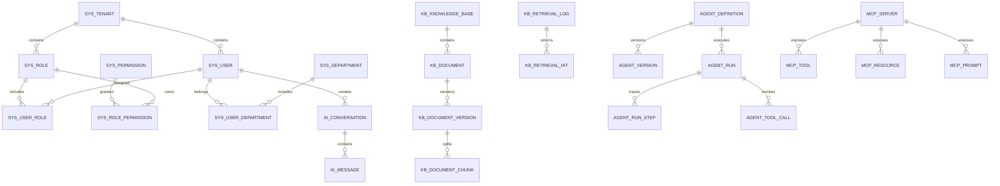

# Enterprise AI Platform 全量数据库字典

> `已迁移`表以主分支 Flyway 为唯一事实来源；`规划`表只是候选设计，不会在本阶段创建数据库或生成迁移 SQL。

## 1. 概览

- 表总数：**43**
- 已迁移表：**8**
- 规划表：**35**
- 字段定义总数：**667**

## 2. 数据库与服务边界

| 数据库 | 负责服务 | 状态 | 主要数据 |
|---|---|---|---|
| `eap_user` | `user-service` / `auth-service` | 已存在 | 租户、用户、组织、角色、权限、认证审计 |
| `eap_ai` | `ai-service` | 已存在 | 会话、消息、模型、Prompt、反馈、模型调用 |
| `eap_knowledge` | `knowledge-service` | 规划 | 知识库、文档、切片、检索、RAG 评测 |
| `eap_agent` | `agent-service` | 规划 | Agent、工具、运行步骤、MCP 能力目录 |

## 3. 通用规则

- 表名使用小写蛇形命名；前缀表示领域：`sys_`、`ai_`、`kb_`、`agent_`、`mcp_`。
- 主键统一使用 `id BIGINT`，Java 实体使用 `Long`。
- 租户业务表必须包含 `tenant_id`，查询不得只依赖业务主键。
- 时间字段使用 `DATETIME(3)`，统一毫秒精度。
- 核心可修改表优先包含 `version`、`deleted`、`created_by`、`created_at`、`updated_by`、`updated_at`。
- 跨服务编号只形成逻辑关联，不创建跨数据库外键。
- 密码、API Key、令牌、MCP 环境变量和认证头禁止明文落库。
- JSON 字段只承载变化频繁的配置；稳定且高频查询的属性必须独立成列。

## 4. 表清单

| 数据库 | 表名 | 中文名称 | 状态 | 阶段 | 负责服务 |
|---|---|---|---|---|---|
| `eap_user` | `sys_tenant` | 租户表 | 已迁移 | 第一迭代 | `user-service` |
| `eap_user` | `sys_user` | 用户表 | 已迁移 | 第一迭代 | `user-service` |
| `eap_user` | `sys_role` | 角色表 | 已迁移 | 第一迭代 | `user-service` |
| `eap_user` | `sys_permission` | 权限表 | 已迁移 | 第一迭代 | `user-service` |
| `eap_user` | `sys_user_role` | 用户角色关联表 | 已迁移 | 第一迭代 | `user-service` |
| `eap_user` | `sys_role_permission` | 角色权限关联表 | 已迁移 | 第一迭代 | `user-service` |
| `eap_ai` | `ai_conversation` | AI 会话表 | 已迁移 | 第一迭代 | `ai-service` |
| `eap_ai` | `ai_message` | AI 消息表 | 已迁移 | 第一迭代 | `ai-service` |
| `eap_user` | `sys_department` | 部门表 | 规划 | 认证与组织增强 | `user-service` |
| `eap_user` | `sys_user_department` | 用户部门关联表 | 规划 | 认证与组织增强 | `user-service` |
| `eap_user` | `sys_login_audit` | 登录审计表 | 规划 | 认证与组织增强 | `auth-service` |
| `eap_user` | `sys_operation_audit` | 操作审计表 | 规划 | 认证与组织增强 | `user-service` |
| `eap_ai` | `ai_model_provider` | 模型供应商配置表 | 规划 | 模型与 Prompt 管理 | `ai-service` |
| `eap_ai` | `ai_model` | 模型定义表 | 规划 | 模型与 Prompt 管理 | `ai-service` |
| `eap_ai` | `ai_prompt_template` | Prompt 模板表 | 规划 | 模型与 Prompt 管理 | `ai-service` |
| `eap_ai` | `ai_prompt_version` | Prompt 版本表 | 规划 | 模型与 Prompt 管理 | `ai-service` |
| `eap_ai` | `ai_message_feedback` | 消息反馈表 | 规划 | 模型与 Prompt 管理 | `ai-service` |
| `eap_ai` | `ai_model_call` | 模型调用记录表 | 规划 | 模型与 Prompt 管理 | `ai-service` |
| `eap_knowledge` | `kb_knowledge_base` | 知识库表 | 规划 | RAG 与知识库 | `knowledge-service` |
| `eap_knowledge` | `kb_knowledge_base_member` | 知识库成员表 | 规划 | RAG 与知识库 | `knowledge-service` |
| `eap_knowledge` | `kb_retrieval_config` | 检索配置表 | 规划 | RAG 与知识库 | `knowledge-service` |
| `eap_knowledge` | `kb_document` | 知识文档表 | 规划 | RAG 与知识库 | `knowledge-service` |
| `eap_knowledge` | `kb_document_version` | 文档版本表 | 规划 | RAG 与知识库 | `knowledge-service` |
| `eap_knowledge` | `kb_ingestion_task` | 知识摄取任务表 | 规划 | RAG 与知识库 | `knowledge-service` |
| `eap_knowledge` | `kb_document_chunk` | 文档切片表 | 规划 | RAG 与知识库 | `knowledge-service` |
| `eap_knowledge` | `kb_retrieval_log` | 检索日志表 | 规划 | RAG 与知识库 | `knowledge-service` |
| `eap_knowledge` | `kb_retrieval_hit` | 检索命中明细表 | 规划 | RAG 与知识库 | `knowledge-service` |
| `eap_knowledge` | `kb_evaluation_dataset` | RAG 评测数据集表 | 规划 | RAG 评测与调优 | `knowledge-service` |
| `eap_knowledge` | `kb_evaluation_case` | RAG 评测用例表 | 规划 | RAG 评测与调优 | `knowledge-service` |
| `eap_knowledge` | `kb_evaluation_run` | RAG 评测运行表 | 规划 | RAG 评测与调优 | `knowledge-service` |
| `eap_knowledge` | `kb_evaluation_result` | RAG 评测结果表 | 规划 | RAG 评测与调优 | `knowledge-service` |
| `eap_agent` | `agent_definition` | Agent 定义表 | 规划 | Agent 与 MCP | `agent-service` |
| `eap_agent` | `agent_version` | Agent 版本表 | 规划 | Agent 与 MCP | `agent-service` |
| `eap_agent` | `agent_run` | Agent 运行表 | 规划 | Agent 与 MCP | `agent-service` |
| `eap_agent` | `agent_run_step` | Agent 运行步骤表 | 规划 | Agent 与 MCP | `agent-service` |
| `eap_agent` | `agent_tool` | Agent 工具定义表 | 规划 | Agent 与 MCP | `agent-service` |
| `eap_agent` | `agent_tool_binding` | Agent 工具绑定表 | 规划 | Agent 与 MCP | `agent-service` |
| `eap_agent` | `agent_tool_call` | 工具调用记录表 | 规划 | Agent 与 MCP | `agent-service` |
| `eap_agent` | `mcp_server` | MCP Server 配置表 | 规划 | Agent 与 MCP | `agent-service` |
| `eap_agent` | `mcp_tool` | MCP 工具目录表 | 规划 | Agent 与 MCP | `agent-service` |
| `eap_agent` | `mcp_resource` | MCP 资源目录表 | 规划 | Agent 与 MCP | `agent-service` |
| `eap_agent` | `mcp_prompt` | MCP Prompt 目录表 | 规划 | Agent 与 MCP | `agent-service` |
| `eap_agent` | `mcp_server_sync_log` | MCP 能力同步日志表 | 规划 | Agent 与 MCP | `agent-service` |

## 5. 逻辑关系总览

> 图中包含跨服务逻辑关系；实际数据库不创建跨服务外键。

## 6. `eap_user` 字段字典

### `sys_tenant` — 租户表

- **状态**：已迁移
- **阶段**：第一迭代
- **负责服务**：`user-service`
- **用途**：保存企业或组织租户，是多租户数据隔离的根节点。

| 字段 | 类型 | 中文含义 | 取值 / 约束 / 使用说明 |
|---|---|---|---|
| `id` | `BIGINT` | 租户主键 | 全局唯一，Java Long |
| `tenant_code` | `VARCHAR(50)` | 租户编码 | 全局唯一；登录时识别租户；创建后原则上不修改 |
| `tenant_name` | `VARCHAR(100)` | 租户名称 |  |
| `status` | `TINYINT` | 租户状态 | 0-禁用；1-启用 |
| `contact_name` | `VARCHAR(50)` | 联系人姓名 | 可为空 |
| `contact_email` | `VARCHAR(100)` | 联系人邮箱 | 可为空；敏感信息 |
| `expire_time` | `DATETIME(3)` | 租户到期时间 | 可为空表示暂不限制 |
| `version` | `INT` | 乐观锁版本号 | 默认 0 |
| `deleted` | `TINYINT` | 逻辑删除标记 | 0-未删除；1-已删除 |
| `created_by` | `BIGINT` | 创建人用户编号 | 可为空 |
| `created_at` | `DATETIME(3)` | 创建时间 | 默认当前时间，毫秒精度 |
| `updated_by` | `BIGINT` | 最后更新人用户编号 | 可为空 |
| `updated_at` | `DATETIME(3)` | 最后更新时间 | 更新时自动刷新 |

### `sys_user` — 用户表

- **状态**：已迁移
- **阶段**：第一迭代
- **负责服务**：`user-service`
- **用途**：保存租户内用户资料、密码摘要和登录安全状态。

| 字段 | 类型 | 中文含义 | 取值 / 约束 / 使用说明 |
|---|---|---|---|
| `id` | `BIGINT` | 用户主键 |  |
| `tenant_id` | `BIGINT` | 所属租户编号 | 所有查询必须同时带 tenant_id |
| `username` | `VARCHAR(50)` | 登录用户名 | 同一租户内唯一 |
| `password_hash` | `VARCHAR(100)` | BCrypt 密码摘要 | 禁止明文保存或日志输出 |
| `display_name` | `VARCHAR(100)` | 用户显示名称 |  |
| `email` | `VARCHAR(100)` | 用户邮箱 | 可为空；租户内非空值唯一；敏感 |
| `mobile` | `VARCHAR(30)` | 用户手机号 | 可为空；敏感 |
| `avatar_url` | `VARCHAR(500)` | 头像资源地址 | 可为空 |
| `status` | `TINYINT` | 用户状态 | 0-禁用；1-启用；2-锁定 |
| `login_fail_count` | `INT` | 连续登录失败次数 | 默认 0；登录成功后清零 |
| `locked_until` | `DATETIME(3)` | 临时锁定截止时间 | 可为空 |
| `password_changed_at` | `DATETIME(3)` | 密码最后修改时间 | 可为空 |
| `last_login_at` | `DATETIME(3)` | 最后成功登录时间 | 可为空 |
| `last_login_ip` | `VARCHAR(64)` | 最后成功登录 IP | 兼容 IPv4/IPv6；敏感 |
| `version` | `INT` | 乐观锁版本号 | 默认 0 |
| `deleted` | `TINYINT` | 逻辑删除标记 | 0-未删除；1-已删除 |
| `created_by` | `BIGINT` | 创建人用户编号 |  |
| `created_at` | `DATETIME(3)` | 创建时间 |  |
| `updated_by` | `BIGINT` | 最后更新人用户编号 |  |
| `updated_at` | `DATETIME(3)` | 最后更新时间 |  |

### `sys_role` — 角色表

- **状态**：已迁移
- **阶段**：第一迭代
- **负责服务**：`user-service`
- **用途**：定义租户内角色，用于聚合权限。

| 字段 | 类型 | 中文含义 | 取值 / 约束 / 使用说明 |
|---|---|---|---|
| `id` | `BIGINT` | 角色主键 |  |
| `tenant_id` | `BIGINT` | 所属租户编号 |  |
| `role_code` | `VARCHAR(100)` | 角色编码 | 租户内唯一；程序权限判断使用 |
| `role_name` | `VARCHAR(100)` | 角色名称 |  |
| `description` | `VARCHAR(500)` | 角色说明 | 可为空 |
| `built_in` | `TINYINT` | 是否内置角色 | 0-否；1-是 |
| `status` | `TINYINT` | 角色状态 | 0-禁用；1-启用 |
| `sort_order` | `INT` | 展示排序值 | 默认 0 |
| `version` | `INT` | 乐观锁版本号 |  |
| `deleted` | `TINYINT` | 逻辑删除标记 |  |
| `created_by` | `BIGINT` | 创建人用户编号 |  |
| `created_at` | `DATETIME(3)` | 创建时间 |  |
| `updated_by` | `BIGINT` | 最后更新人用户编号 |  |
| `updated_at` | `DATETIME(3)` | 最后更新时间 |  |

### `sys_permission` — 权限表

- **状态**：已迁移
- **阶段**：第一迭代
- **负责服务**：`user-service`
- **用途**：定义平台菜单、按钮和接口权限资源。

| 字段 | 类型 | 中文含义 | 取值 / 约束 / 使用说明 |
|---|---|---|---|
| `id` | `BIGINT` | 权限主键 |  |
| `permission_code` | `VARCHAR(150)` | 权限编码 | 全局唯一；格式：资源:动作 |
| `permission_name` | `VARCHAR(100)` | 权限名称 |  |
| `permission_type` | `TINYINT` | 权限类型 | 1-菜单；2-按钮；3-接口 |
| `parent_id` | `BIGINT` | 父权限编号 | 0 表示根节点 |
| `resource_path` | `VARCHAR(255)` | 资源路径 | 菜单路由或接口路径；可为空 |
| `http_method` | `VARCHAR(10)` | HTTP 请求方法 | GET/POST/PUT/PATCH/DELETE；可为空 |
| `description` | `VARCHAR(500)` | 权限说明 |  |
| `sort_order` | `INT` | 展示排序值 |  |
| `status` | `TINYINT` | 权限状态 | 0-禁用；1-启用 |
| `version` | `INT` | 乐观锁版本号 |  |
| `deleted` | `TINYINT` | 逻辑删除标记 |  |
| `created_by` | `BIGINT` | 创建人用户编号 |  |
| `created_at` | `DATETIME(3)` | 创建时间 |  |
| `updated_by` | `BIGINT` | 最后更新人用户编号 |  |
| `updated_at` | `DATETIME(3)` | 最后更新时间 |  |

### `sys_user_role` — 用户角色关联表

- **状态**：已迁移
- **阶段**：第一迭代
- **负责服务**：`user-service`
- **用途**：建立用户与角色的多对多关系。

| 字段 | 类型 | 中文含义 | 取值 / 约束 / 使用说明 |
|---|---|---|---|
| `id` | `BIGINT` | 关联记录主键 |  |
| `tenant_id` | `BIGINT` | 所属租户编号 |  |
| `user_id` | `BIGINT` | 用户编号 |  |
| `role_id` | `BIGINT` | 角色编号 |  |
| `created_by` | `BIGINT` | 创建人用户编号 |  |
| `created_at` | `DATETIME(3)` | 创建时间 |  |

> 用户和角色必须属于同一租户；关联记录可物理删除。

### `sys_role_permission` — 角色权限关联表

- **状态**：已迁移
- **阶段**：第一迭代
- **负责服务**：`user-service`
- **用途**：建立角色与权限的多对多关系。

| 字段 | 类型 | 中文含义 | 取值 / 约束 / 使用说明 |
|---|---|---|---|
| `id` | `BIGINT` | 关联记录主键 |  |
| `tenant_id` | `BIGINT` | 授权所属租户编号 |  |
| `role_id` | `BIGINT` | 角色编号 |  |
| `permission_id` | `BIGINT` | 权限编号 |  |
| `created_by` | `BIGINT` | 创建人用户编号 |  |
| `created_at` | `DATETIME(3)` | 创建时间 |  |

### `sys_department` — 部门表

- **状态**：规划
- **阶段**：认证与组织增强
- **负责服务**：`user-service`
- **用途**：保存租户内组织树，用于用户归属和知识权限继承。

| 字段 | 类型 | 中文含义 | 取值 / 约束 / 使用说明 |
|---|---|---|---|
| `id` | `BIGINT` | 部门主键 |  |
| `tenant_id` | `BIGINT` | 所属租户编号 |  |
| `parent_id` | `BIGINT` | 父部门编号 | 0 表示根部门 |
| `department_code` | `VARCHAR(100)` | 部门编码 | 租户内唯一 |
| `department_name` | `VARCHAR(100)` | 部门名称 |  |
| `leader_user_id` | `BIGINT` | 部门负责人用户编号 | 可为空 |
| `path` | `VARCHAR(1000)` | 祖先路径 | 示例 /1/10/103/，便于子树查询 |
| `level` | `INT` | 组织层级 | 根部门为 1 |
| `sort_order` | `INT` | 同级展示顺序 |  |
| `status` | `TINYINT` | 部门状态 | 0-禁用；1-启用 |
| `version` | `INT` | 乐观锁版本号 |  |
| `deleted` | `TINYINT` | 逻辑删除标记 |  |
| `created_by` | `BIGINT` | 创建人用户编号 |  |
| `created_at` | `DATETIME(3)` | 创建时间 |  |
| `updated_by` | `BIGINT` | 最后更新人用户编号 |  |
| `updated_at` | `DATETIME(3)` | 最后更新时间 |  |

### `sys_user_department` — 用户部门关联表

- **状态**：规划
- **阶段**：认证与组织增强
- **负责服务**：`user-service`
- **用途**：建立用户与部门关系，支持兼任部门和主部门。

| 字段 | 类型 | 中文含义 | 取值 / 约束 / 使用说明 |
|---|---|---|---|
| `id` | `BIGINT` | 关联主键 |  |
| `tenant_id` | `BIGINT` | 所属租户编号 |  |
| `user_id` | `BIGINT` | 用户编号 |  |
| `department_id` | `BIGINT` | 部门编号 |  |
| `primary_flag` | `TINYINT` | 是否主部门 | 0-否；1-是 |
| `position_name` | `VARCHAR(100)` | 用户在该部门的岗位名称 | 可为空 |
| `created_by` | `BIGINT` | 创建人用户编号 |  |
| `created_at` | `DATETIME(3)` | 创建时间 |  |

### `sys_login_audit` — 登录审计表

- **状态**：规划
- **阶段**：认证与组织增强
- **负责服务**：`auth-service`
- **用途**：记录登录成功、失败、锁定和退出事件，支持安全审计。

| 字段 | 类型 | 中文含义 | 取值 / 约束 / 使用说明 |
|---|---|---|---|
| `id` | `BIGINT` | 审计记录主键 |  |
| `tenant_id` | `BIGINT` | 解析后的租户编号 | 未识别时可为空 |
| `tenant_code` | `VARCHAR(50)` | 登录请求中的租户编码 |  |
| `user_id` | `BIGINT` | 解析后的用户编号 | 登录失败时可为空 |
| `username` | `VARCHAR(50)` | 登录请求用户名 | 按脱敏策略展示 |
| `login_type` | `VARCHAR(30)` | 登录方式 | PASSWORD/SSO/API_CLIENT |
| `login_result` | `VARCHAR(20)` | 登录结果 | SUCCESS/FAILURE/LOCKED/LOGOUT |
| `failure_reason` | `VARCHAR(100)` | 失败原因编码 | 不得记录明文密码 |
| `client_ip` | `VARCHAR(64)` | 客户端 IP | 敏感 |
| `user_agent` | `VARCHAR(1000)` | 客户端 User-Agent | 敏感 |
| `device_id` | `VARCHAR(128)` | 客户端设备标识 | 可为空；敏感 |
| `request_id` | `VARCHAR(64)` | 请求链路编号 |  |
| `occurred_at` | `DATETIME(3)` | 事件发生时间 |  |

> 只追加，不做普通逻辑删除；按合规周期归档。

### `sys_operation_audit` — 操作审计表

- **状态**：规划
- **阶段**：认证与组织增强
- **负责服务**：`user-service`
- **用途**：记录后台管理和高风险数据变更行为。

| 字段 | 类型 | 中文含义 | 取值 / 约束 / 使用说明 |
|---|---|---|---|
| `id` | `BIGINT` | 审计记录主键 |  |
| `tenant_id` | `BIGINT` | 所属租户编号 |  |
| `user_id` | `BIGINT` | 操作者用户编号 | 系统任务可为空 |
| `service_name` | `VARCHAR(100)` | 执行操作的服务名 |  |
| `operation_type` | `VARCHAR(50)` | 操作类型 | CREATE/UPDATE/DELETE/EXPORT/GRANT 等 |
| `resource_type` | `VARCHAR(100)` | 被操作资源类型 |  |
| `resource_id` | `VARCHAR(100)` | 被操作资源编号 |  |
| `request_method` | `VARCHAR(10)` | HTTP 方法 |  |
| `request_path` | `VARCHAR(500)` | 请求路径 |  |
| `request_id` | `VARCHAR(64)` | 请求链路编号 |  |
| `client_ip` | `VARCHAR(64)` | 客户端 IP | 敏感 |
| `result_status` | `VARCHAR(20)` | 执行结果 | SUCCESS/FAILURE |
| `error_code` | `VARCHAR(100)` | 失败错误码 |  |
| `summary` | `VARCHAR(1000)` | 可读操作摘要 | 不得包含密码或密钥 |
| `detail_json` | `JSON` | 变更前后差异或附加信息 | 字段级脱敏 |
| `occurred_at` | `DATETIME(3)` | 操作发生时间 |  |

> 只追加；敏感字段必须脱敏。

## 7. `eap_ai` 字段字典

### `ai_conversation` — AI 会话表

- **状态**：已迁移
- **阶段**：第一迭代
- **负责服务**：`ai-service`
- **用途**：保存用户与 AI 的会话级元数据。

| 字段 | 类型 | 中文含义 | 取值 / 约束 / 使用说明 |
|---|---|---|---|
| `id` | `BIGINT` | 会话主键 |  |
| `tenant_id` | `BIGINT` | 所属租户编号 |  |
| `user_id` | `BIGINT` | 会话所属用户编号 | 逻辑关联 sys_user.id，不建跨服务外键 |
| `title` | `VARCHAR(200)` | 会话标题 |  |
| `knowledge_base_id` | `BIGINT` | 关联知识库编号 | 第一迭代为空 |
| `model_code` | `VARCHAR(100)` | 会话默认模型编码 | 可为空 |
| `status` | `TINYINT` | 会话状态 | 1-正常；2-归档 |
| `message_count` | `INT` | 会话消息数量 | 默认 0，新增消息时维护 |
| `last_message_at` | `DATETIME(3)` | 最后消息时间 | 可为空 |
| `version` | `INT` | 乐观锁版本号 |  |
| `deleted` | `TINYINT` | 逻辑删除标记 |  |
| `created_by` | `BIGINT` | 创建人用户编号 |  |
| `created_at` | `DATETIME(3)` | 创建时间 |  |
| `updated_by` | `BIGINT` | 最后更新人用户编号 |  |
| `updated_at` | `DATETIME(3)` | 最后更新时间 |  |

### `ai_message` — AI 消息表

- **状态**：已迁移
- **阶段**：第一迭代
- **负责服务**：`ai-service`
- **用途**：保存会话中的用户、助手、系统和工具消息。

| 字段 | 类型 | 中文含义 | 取值 / 约束 / 使用说明 |
|---|---|---|---|
| `id` | `BIGINT` | 消息主键 |  |
| `tenant_id` | `BIGINT` | 所属租户编号 |  |
| `conversation_id` | `BIGINT` | 所属会话编号 |  |
| `user_id` | `BIGINT` | 会话所属用户编号 |  |
| `parent_message_id` | `BIGINT` | 父消息编号 | 支持重新生成和消息树；可为空 |
| `client_message_id` | `VARCHAR(64)` | 客户端消息唯一编号 | 用于幂等；可为空 |
| `request_id` | `VARCHAR(64)` | 请求链路编号 | 可为空 |
| `role` | `VARCHAR(20)` | 消息角色 | SYSTEM/USER/ASSISTANT/TOOL |
| `content_type` | `VARCHAR(20)` | 内容类型 | 默认 TEXT |
| `content` | `MEDIUMTEXT` | 消息正文 | 可能包含企业敏感信息 |
| `message_status` | `TINYINT` | 消息状态 | 1-完成；2-生成中；3-失败 |
| `model_code` | `VARCHAR(100)` | 生成消息使用的模型编码 |  |
| `prompt_tokens` | `INT` | 输入 Token 数量 | 默认 0 |
| `completion_tokens` | `INT` | 输出 Token 数量 | 默认 0 |
| `total_tokens` | `INT` | 总 Token 数量 | 默认 0 |
| `latency_ms` | `BIGINT` | 模型调用耗时 | 单位毫秒 |
| `finish_reason` | `VARCHAR(50)` | 模型停止原因 |  |
| `error_code` | `VARCHAR(100)` | 失败错误码 |  |
| `metadata_json` | `JSON` | 扩展元数据 | 禁止放入密钥 |
| `created_at` | `DATETIME(3)` | 创建时间 |  |
| `updated_at` | `DATETIME(3)` | 更新时间 |  |

### `ai_model_provider` — 模型供应商配置表

- **状态**：规划
- **阶段**：模型与 Prompt 管理
- **负责服务**：`ai-service`
- **用途**：保存租户可用的模型供应商连接和安全配置。

| 字段 | 类型 | 中文含义 | 取值 / 约束 / 使用说明 |
|---|---|---|---|
| `id` | `BIGINT` | 供应商配置主键 |  |
| `tenant_id` | `BIGINT` | 所属租户编号 |  |
| `provider_code` | `VARCHAR(100)` | 供应商配置编码 | 租户内唯一 |
| `provider_name` | `VARCHAR(100)` | 供应商显示名称 |  |
| `provider_type` | `VARCHAR(50)` | 供应商类型 | OPENAI_COMPATIBLE/AZURE_OPENAI/OLLAMA 等 |
| `base_url` | `VARCHAR(500)` | API 基础地址 |  |
| `api_key_ciphertext` | `TEXT` | 加密后的 API Key | 仅保存密文，禁止接口回显 |
| `secret_version` | `INT` | 密钥版本号 | 用于轮换 |
| `timeout_ms` | `INT` | 请求超时时间 | 单位毫秒 |
| `proxy_url` | `VARCHAR(500)` | 可选代理地址 | 敏感 |
| `config_json` | `JSON` | 供应商扩展配置 | 禁止保存明文密钥 |
| `status` | `TINYINT` | 配置状态 | 0-禁用；1-启用 |
| `version` | `INT` | 乐观锁版本号 |  |
| `deleted` | `TINYINT` | 逻辑删除标记 |  |
| `created_by` | `BIGINT` | 创建人用户编号 |  |
| `created_at` | `DATETIME(3)` | 创建时间 |  |
| `updated_by` | `BIGINT` | 最后更新人用户编号 |  |
| `updated_at` | `DATETIME(3)` | 最后更新时间 |  |

### `ai_model` — 模型定义表

- **状态**：规划
- **阶段**：模型与 Prompt 管理
- **负责服务**：`ai-service`
- **用途**：定义聊天、向量、重排和多模态模型能力及计费参数。

| 字段 | 类型 | 中文含义 | 取值 / 约束 / 使用说明 |
|---|---|---|---|
| `id` | `BIGINT` | 模型主键 |  |
| `tenant_id` | `BIGINT` | 所属租户编号 |  |
| `provider_id` | `BIGINT` | 模型供应商配置编号 |  |
| `model_code` | `VARCHAR(100)` | 平台模型编码 | 租户内唯一，业务引用使用 |
| `remote_model_name` | `VARCHAR(200)` | 供应商侧模型名称 |  |
| `model_name` | `VARCHAR(100)` | 平台显示名称 |  |
| `model_type` | `VARCHAR(30)` | 模型类型 | CHAT/EMBEDDING/RERANK/MULTIMODAL |
| `context_window` | `INT` | 上下文窗口 Token 上限 |  |
| `max_output_tokens` | `INT` | 最大输出 Token 数 |  |
| `supports_streaming` | `TINYINT` | 是否支持流式输出 |  |
| `supports_tools` | `TINYINT` | 是否支持工具调用 |  |
| `supports_json` | `TINYINT` | 是否支持结构化 JSON 输出 |  |
| `supports_vision` | `TINYINT` | 是否支持图片输入 |  |
| `default_temperature` | `DECIMAL(5,4)` | 默认温度参数 |  |
| `input_price_per_million` | `DECIMAL(18,6)` | 每百万输入 Token 价格 |  |
| `output_price_per_million` | `DECIMAL(18,6)` | 每百万输出 Token 价格 |  |
| `currency` | `VARCHAR(10)` | 计费币种 | ISO 4217 代码 |
| `config_json` | `JSON` | 模型扩展参数 |  |
| `status` | `TINYINT` | 模型状态 |  |
| `version` | `INT` | 乐观锁版本号 |  |
| `deleted` | `TINYINT` | 逻辑删除标记 |  |
| `created_by` | `BIGINT` | 创建人用户编号 |  |
| `created_at` | `DATETIME(3)` | 创建时间 |  |
| `updated_by` | `BIGINT` | 最后更新人用户编号 |  |
| `updated_at` | `DATETIME(3)` | 最后更新时间 |  |

### `ai_prompt_template` — Prompt 模板表

- **状态**：规划
- **阶段**：模型与 Prompt 管理
- **负责服务**：`ai-service`
- **用途**：保存可版本化的 Prompt 业务模板元数据。

| 字段 | 类型 | 中文含义 | 取值 / 约束 / 使用说明 |
|---|---|---|---|
| `id` | `BIGINT` | 模板主键 |  |
| `tenant_id` | `BIGINT` | 所属租户编号 |  |
| `prompt_code` | `VARCHAR(100)` | Prompt 编码 | 租户内唯一 |
| `prompt_name` | `VARCHAR(150)` | Prompt 名称 |  |
| `prompt_category` | `VARCHAR(50)` | Prompt 分类 | CHAT/RAG/AGENT/EVALUATION 等 |
| `description` | `VARCHAR(1000)` | 模板用途说明 |  |
| `active_version_id` | `BIGINT` | 当前生效版本编号 |  |
| `status` | `TINYINT` | 模板状态 |  |
| `version` | `INT` | 乐观锁版本号 |  |
| `deleted` | `TINYINT` | 逻辑删除标记 |  |
| `created_by` | `BIGINT` | 创建人用户编号 |  |
| `created_at` | `DATETIME(3)` | 创建时间 |  |
| `updated_by` | `BIGINT` | 最后更新人用户编号 |  |
| `updated_at` | `DATETIME(3)` | 最后更新时间 |  |

### `ai_prompt_version` — Prompt 版本表

- **状态**：规划
- **阶段**：模型与 Prompt 管理
- **负责服务**：`ai-service`
- **用途**：保存 Prompt 内容、变量定义和模型参数的历史版本。

| 字段 | 类型 | 中文含义 | 取值 / 约束 / 使用说明 |
|---|---|---|---|
| `id` | `BIGINT` | Prompt 版本主键 |  |
| `tenant_id` | `BIGINT` | 所属租户编号 |  |
| `template_id` | `BIGINT` | 所属 Prompt 模板编号 |  |
| `version_no` | `INT` | 版本号 | 同一模板内递增 |
| `system_prompt` | `MEDIUMTEXT` | 系统提示词 | 可能包含企业策略 |
| `user_prompt_template` | `MEDIUMTEXT` | 用户提示词模板 | 使用命名变量占位符 |
| `variables_json` | `JSON` | 模板变量定义 | 名称、类型、必填、默认值 |
| `model_parameters_json` | `JSON` | 推荐模型参数 |  |
| `change_note` | `VARCHAR(1000)` | 版本变更说明 |  |
| `publish_status` | `VARCHAR(20)` | 发布状态 | DRAFT/PUBLISHED/RETIRED |
| `published_by` | `BIGINT` | 发布人用户编号 |  |
| `published_at` | `DATETIME(3)` | 发布时间 |  |
| `created_by` | `BIGINT` | 创建人用户编号 |  |
| `created_at` | `DATETIME(3)` | 创建时间 |  |

### `ai_message_feedback` — 消息反馈表

- **状态**：规划
- **阶段**：模型与 Prompt 管理
- **负责服务**：`ai-service`
- **用途**：记录用户对 AI 回答的评分、问题类型和修正建议。

| 字段 | 类型 | 中文含义 | 取值 / 约束 / 使用说明 |
|---|---|---|---|
| `id` | `BIGINT` | 反馈主键 |  |
| `tenant_id` | `BIGINT` | 所属租户编号 |  |
| `conversation_id` | `BIGINT` | 会话编号 |  |
| `message_id` | `BIGINT` | 被评价的助手消息编号 |  |
| `user_id` | `BIGINT` | 反馈用户编号 |  |
| `rating` | `TINYINT` | 评分 | -1-差评；1-好评 |
| `feedback_type` | `VARCHAR(50)` | 反馈问题类型 | INACCURATE/UNSAFE/IRRELEVANT/OUTDATED 等 |
| `comment` | `VARCHAR(2000)` | 用户反馈说明 | 敏感 |
| `issue_tags_json` | `JSON` | 问题标签集合 |  |
| `corrected_answer` | `MEDIUMTEXT` | 用户提供的参考修正答案 | 敏感 |
| `created_at` | `DATETIME(3)` | 创建时间 |  |
| `updated_at` | `DATETIME(3)` | 更新时间 |  |

### `ai_model_call` — 模型调用记录表

- **状态**：规划
- **阶段**：模型与 Prompt 管理
- **负责服务**：`ai-service`
- **用途**：记录每次模型调用的状态、耗时、Token 和估算成本。

| 字段 | 类型 | 中文含义 | 取值 / 约束 / 使用说明 |
|---|---|---|---|
| `id` | `BIGINT` | 调用记录主键 |  |
| `tenant_id` | `BIGINT` | 所属租户编号 |  |
| `request_id` | `VARCHAR(64)` | 请求链路编号 |  |
| `conversation_id` | `BIGINT` | 关联会话编号 |  |
| `message_id` | `BIGINT` | 关联生成消息编号 |  |
| `user_id` | `BIGINT` | 发起用户编号 |  |
| `provider_code` | `VARCHAR(100)` | 供应商配置编码 |  |
| `model_code` | `VARCHAR(100)` | 平台模型编码 |  |
| `call_type` | `VARCHAR(30)` | 调用类型 | CHAT/EMBEDDING/RERANK/JUDGE |
| `call_status` | `VARCHAR(20)` | 调用状态 | SUCCESS/FAILURE/TIMEOUT/CANCELLED |
| `prompt_tokens` | `INT` | 输入 Token 数 |  |
| `completion_tokens` | `INT` | 输出 Token 数 |  |
| `total_tokens` | `INT` | 总 Token 数 |  |
| `cached_tokens` | `INT` | 缓存 Token 数 |  |
| `latency_ms` | `BIGINT` | 总调用耗时 |  |
| `first_token_latency_ms` | `BIGINT` | 首 Token 延迟 |  |
| `estimated_cost` | `DECIMAL(18,8)` | 估算费用 |  |
| `currency` | `VARCHAR(10)` | 费用币种 |  |
| `error_code` | `VARCHAR(100)` | 失败错误码 |  |
| `error_message` | `VARCHAR(2000)` | 脱敏后的错误信息 |  |
| `request_metadata_json` | `JSON` | 脱敏请求元数据 | 不保存完整 Prompt 或密钥 |
| `response_metadata_json` | `JSON` | 供应商响应元数据 |  |
| `started_at` | `DATETIME(3)` | 调用开始时间 |  |
| `finished_at` | `DATETIME(3)` | 调用结束时间 |  |
| `created_at` | `DATETIME(3)` | 记录创建时间 |  |

## 8. `eap_knowledge` 字段字典

### `kb_knowledge_base` — 知识库表

- **状态**：规划
- **阶段**：RAG 与知识库
- **负责服务**：`knowledge-service`
- **用途**：保存知识库基础信息、模型选择和默认检索配置。

| 字段 | 类型 | 中文含义 | 取值 / 约束 / 使用说明 |
|---|---|---|---|
| `id` | `BIGINT` | 知识库主键 |  |
| `tenant_id` | `BIGINT` | 所属租户编号 |  |
| `kb_code` | `VARCHAR(100)` | 知识库编码 | 租户内唯一 |
| `kb_name` | `VARCHAR(150)` | 知识库名称 |  |
| `description` | `VARCHAR(2000)` | 知识库说明 |  |
| `visibility` | `VARCHAR(20)` | 可见范围 | PRIVATE/TENANT/PUBLIC |
| `owner_user_id` | `BIGINT` | 知识库负责人用户编号 |  |
| `embedding_model_code` | `VARCHAR(100)` | 向量模型编码 |  |
| `rerank_model_code` | `VARCHAR(100)` | 重排模型编码 | 可为空 |
| `default_retrieval_config_id` | `BIGINT` | 默认检索配置编号 | 可为空 |
| `status` | `TINYINT` | 知识库状态 | 0-禁用；1-启用；2-构建中 |
| `version` | `INT` | 乐观锁版本号 |  |
| `deleted` | `TINYINT` | 逻辑删除标记 |  |
| `created_by` | `BIGINT` | 创建人用户编号 |  |
| `created_at` | `DATETIME(3)` | 创建时间 |  |
| `updated_by` | `BIGINT` | 最后更新人用户编号 |  |
| `updated_at` | `DATETIME(3)` | 最后更新时间 |  |

### `kb_knowledge_base_member` — 知识库成员表

- **状态**：规划
- **阶段**：RAG 与知识库
- **负责服务**：`knowledge-service`
- **用途**：为用户、部门或角色授予知识库访问权限。

| 字段 | 类型 | 中文含义 | 取值 / 约束 / 使用说明 |
|---|---|---|---|
| `id` | `BIGINT` | 成员授权主键 |  |
| `tenant_id` | `BIGINT` | 所属租户编号 |  |
| `knowledge_base_id` | `BIGINT` | 知识库编号 |  |
| `subject_type` | `VARCHAR(20)` | 授权主体类型 | USER/DEPARTMENT/ROLE |
| `subject_id` | `BIGINT` | 授权主体编号 |  |
| `access_level` | `VARCHAR(20)` | 访问级别 | VIEW/EDIT/MANAGE |
| `created_by` | `BIGINT` | 创建人用户编号 |  |
| `created_at` | `DATETIME(3)` | 创建时间 |  |

### `kb_retrieval_config` — 检索配置表

- **状态**：规划
- **阶段**：RAG 与知识库
- **负责服务**：`knowledge-service`
- **用途**：保存 Top-K、阈值、混合检索和上下文预算等可调参数。

| 字段 | 类型 | 中文含义 | 取值 / 约束 / 使用说明 |
|---|---|---|---|
| `id` | `BIGINT` | 检索配置主键 |  |
| `tenant_id` | `BIGINT` | 所属租户编号 |  |
| `knowledge_base_id` | `BIGINT` | 知识库编号 |  |
| `config_name` | `VARCHAR(100)` | 配置名称 |  |
| `chunk_top_k` | `INT` | 初始召回切片数量 |  |
| `rerank_top_n` | `INT` | 重排后保留数量 |  |
| `score_threshold` | `DECIMAL(8,6)` | 最低相关性阈值 |  |
| `vector_weight` | `DECIMAL(5,4)` | 向量检索权重 |  |
| `keyword_weight` | `DECIMAL(5,4)` | 关键词检索权重 |  |
| `max_context_tokens` | `INT` | 送入模型的最大上下文 Token |  |
| `query_rewrite_enabled` | `TINYINT` | 是否启用查询改写 |  |
| `multi_query_enabled` | `TINYINT` | 是否启用多查询扩展 |  |
| `metadata_filter_json` | `JSON` | 默认元数据过滤条件 |  |
| `status` | `TINYINT` | 配置状态 |  |
| `version` | `INT` | 乐观锁版本号 |  |
| `deleted` | `TINYINT` | 逻辑删除标记 |  |
| `created_by` | `BIGINT` | 创建人用户编号 |  |
| `created_at` | `DATETIME(3)` | 创建时间 |  |
| `updated_by` | `BIGINT` | 最后更新人用户编号 |  |
| `updated_at` | `DATETIME(3)` | 最后更新时间 |  |

### `kb_document` — 知识文档表

- **状态**：规划
- **阶段**：RAG 与知识库
- **负责服务**：`knowledge-service`
- **用途**：保存知识库中文档的业务元数据和处理状态。

| 字段 | 类型 | 中文含义 | 取值 / 约束 / 使用说明 |
|---|---|---|---|
| `id` | `BIGINT` | 文档主键 |  |
| `tenant_id` | `BIGINT` | 所属租户编号 |  |
| `knowledge_base_id` | `BIGINT` | 所属知识库编号 |  |
| `document_name` | `VARCHAR(255)` | 文档展示名称 |  |
| `source_type` | `VARCHAR(30)` | 来源类型 | UPLOAD/URL/WEBHOOK/DRIVE/API |
| `source_uri` | `VARCHAR(1000)` | 原始来源地址 | 可为空；可能包含内部地址 |
| `file_name` | `VARCHAR(255)` | 原始文件名 |  |
| `file_extension` | `VARCHAR(30)` | 文件扩展名 |  |
| `mime_type` | `VARCHAR(100)` | MIME 类型 |  |
| `file_size_bytes` | `BIGINT` | 文件大小 | 单位字节 |
| `file_hash` | `VARCHAR(128)` | 文件内容摘要 | 用于去重和版本识别 |
| `current_version_id` | `BIGINT` | 当前有效文档版本编号 |  |
| `parsing_status` | `VARCHAR(20)` | 解析状态 | PENDING/RUNNING/SUCCESS/FAILED |
| `indexing_status` | `VARCHAR(20)` | 索引状态 | PENDING/RUNNING/SUCCESS/FAILED |
| `chunk_count` | `INT` | 当前版本切片数量 |  |
| `language` | `VARCHAR(20)` | 文档主要语言 | 如 zh-CN、en-US |
| `status` | `TINYINT` | 文档状态 |  |
| `version` | `INT` | 乐观锁版本号 |  |
| `deleted` | `TINYINT` | 逻辑删除标记 |  |
| `created_by` | `BIGINT` | 创建人用户编号 |  |
| `created_at` | `DATETIME(3)` | 创建时间 |  |
| `updated_by` | `BIGINT` | 最后更新人用户编号 |  |
| `updated_at` | `DATETIME(3)` | 最后更新时间 |  |

### `kb_document_version` — 文档版本表

- **状态**：规划
- **阶段**：RAG 与知识库
- **负责服务**：`knowledge-service`
- **用途**：保存文档每次上传或同步形成的不可变版本。

| 字段 | 类型 | 中文含义 | 取值 / 约束 / 使用说明 |
|---|---|---|---|
| `id` | `BIGINT` | 文档版本主键 |  |
| `tenant_id` | `BIGINT` | 所属租户编号 |  |
| `document_id` | `BIGINT` | 文档编号 |  |
| `version_no` | `INT` | 文档版本号 | 同一文档内递增 |
| `storage_uri` | `VARCHAR(1000)` | 原始文件对象存储地址 | 敏感 |
| `file_hash` | `VARCHAR(128)` | 版本文件摘要 |  |
| `extractor_code` | `VARCHAR(100)` | 文本提取器编码 |  |
| `parser_config_json` | `JSON` | 解析和切片参数快照 |  |
| `extracted_content_uri` | `VARCHAR(1000)` | 提取正文对象存储地址 | 敏感 |
| `text_length` | `BIGINT` | 提取文本字符数 |  |
| `page_count` | `INT` | 页数或逻辑页面数 |  |
| `version_status` | `VARCHAR(20)` | 版本处理状态 | PENDING/PROCESSING/READY/FAILED |
| `error_message` | `VARCHAR(2000)` | 脱敏后的失败说明 |  |
| `created_by` | `BIGINT` | 创建人用户编号 |  |
| `created_at` | `DATETIME(3)` | 创建时间 |  |

### `kb_ingestion_task` — 知识摄取任务表

- **状态**：规划
- **阶段**：RAG 与知识库
- **负责服务**：`knowledge-service`
- **用途**：追踪文档提取、切片、向量化和索引任务。

| 字段 | 类型 | 中文含义 | 取值 / 约束 / 使用说明 |
|---|---|---|---|
| `id` | `BIGINT` | 任务主键 |  |
| `tenant_id` | `BIGINT` | 所属租户编号 |  |
| `knowledge_base_id` | `BIGINT` | 知识库编号 |  |
| `document_id` | `BIGINT` | 文档编号 |  |
| `document_version_id` | `BIGINT` | 文档版本编号 |  |
| `task_type` | `VARCHAR(30)` | 任务类型 | FULL/PARSE/CHUNK/EMBED/DELETE_INDEX |
| `task_status` | `VARCHAR(20)` | 任务状态 | PENDING/RUNNING/SUCCESS/FAILED/CANCELLED |
| `current_stage` | `VARCHAR(30)` | 当前处理阶段 |  |
| `progress_percent` | `INT` | 进度百分比 | 0 至 100 |
| `retry_count` | `INT` | 已重试次数 |  |
| `max_retries` | `INT` | 最大重试次数 |  |
| `error_code` | `VARCHAR(100)` | 失败错误码 |  |
| `error_message` | `VARCHAR(2000)` | 脱敏后的失败说明 |  |
| `worker_id` | `VARCHAR(100)` | 执行工作节点标识 |  |
| `started_at` | `DATETIME(3)` | 任务开始时间 |  |
| `finished_at` | `DATETIME(3)` | 任务结束时间 |  |
| `created_at` | `DATETIME(3)` | 任务创建时间 |  |
| `updated_at` | `DATETIME(3)` | 任务更新时间 |  |

### `kb_document_chunk` — 文档切片表

- **状态**：规划
- **阶段**：RAG 与知识库
- **负责服务**：`knowledge-service`
- **用途**：保存文档切片文本、定位信息和向量索引引用。

| 字段 | 类型 | 中文含义 | 取值 / 约束 / 使用说明 |
|---|---|---|---|
| `id` | `BIGINT` | 切片主键 |  |
| `tenant_id` | `BIGINT` | 所属租户编号 |  |
| `knowledge_base_id` | `BIGINT` | 知识库编号 |  |
| `document_id` | `BIGINT` | 文档编号 |  |
| `document_version_id` | `BIGINT` | 文档版本编号 |  |
| `chunk_no` | `INT` | 文档版本内切片序号 |  |
| `chunk_text` | `MEDIUMTEXT` | 切片正文 | 可能包含企业知识 |
| `chunk_hash` | `VARCHAR(128)` | 切片内容摘要 | 用于去重和变更检测 |
| `token_count` | `INT` | 切片 Token 数 |  |
| `char_count` | `INT` | 切片字符数 |  |
| `page_no` | `INT` | 原文页码或逻辑页码 |  |
| `section_title` | `VARCHAR(500)` | 章节标题 |  |
| `start_offset` | `BIGINT` | 提取正文中的起始字符偏移 |  |
| `end_offset` | `BIGINT` | 结束字符偏移 |  |
| `metadata_json` | `JSON` | 标题、表格、标签等元数据 |  |
| `embedding_status` | `VARCHAR(20)` | 向量化状态 | PENDING/SUCCESS/FAILED |
| `vector_id` | `VARCHAR(200)` | 向量数据库记录编号 |  |
| `created_at` | `DATETIME(3)` | 创建时间 |  |
| `updated_at` | `DATETIME(3)` | 更新时间 |  |

> 向量值不存 MySQL；MySQL 只保存切片元数据和 vector_id。

### `kb_retrieval_log` — 检索日志表

- **状态**：规划
- **阶段**：RAG 与知识库
- **负责服务**：`knowledge-service`
- **用途**：记录每次 RAG 检索使用的查询、配置、性能和结果数。

| 字段 | 类型 | 中文含义 | 取值 / 约束 / 使用说明 |
|---|---|---|---|
| `id` | `BIGINT` | 检索日志主键 |  |
| `tenant_id` | `BIGINT` | 所属租户编号 |  |
| `request_id` | `VARCHAR(64)` | 请求链路编号 |  |
| `conversation_id` | `BIGINT` | 关联 AI 会话编号 |  |
| `message_id` | `BIGINT` | 关联用户问题消息编号 |  |
| `user_id` | `BIGINT` | 发起用户编号 |  |
| `knowledge_base_id` | `BIGINT` | 知识库编号 |  |
| `retrieval_config_id` | `BIGINT` | 使用的检索配置编号 |  |
| `original_query` | `TEXT` | 用户原始检索问题 | 敏感 |
| `rewritten_query` | `TEXT` | 改写后的检索问题 | 可为空；敏感 |
| `top_k` | `INT` | 实际召回数量 |  |
| `score_threshold` | `DECIMAL(8,6)` | 实际最低分阈值 |  |
| `retrieval_mode` | `VARCHAR(30)` | 检索模式 | VECTOR/KEYWORD/HYBRID |
| `latency_ms` | `BIGINT` | 检索总耗时 |  |
| `result_count` | `INT` | 检索命中数量 |  |
| `filter_json` | `JSON` | 实际元数据过滤条件 |  |
| `created_at` | `DATETIME(3)` | 检索时间 |  |

### `kb_retrieval_hit` — 检索命中明细表

- **状态**：规划
- **阶段**：RAG 与知识库
- **负责服务**：`knowledge-service`
- **用途**：保存每次检索命中的切片及各阶段评分。

| 字段 | 类型 | 中文含义 | 取值 / 约束 / 使用说明 |
|---|---|---|---|
| `id` | `BIGINT` | 命中明细主键 |  |
| `tenant_id` | `BIGINT` | 所属租户编号 |  |
| `retrieval_log_id` | `BIGINT` | 检索日志编号 |  |
| `rank_no` | `INT` | 最终排序名次 |  |
| `chunk_id` | `BIGINT` | 命中切片编号 |  |
| `document_id` | `BIGINT` | 命中文档编号 |  |
| `vector_score` | `DECIMAL(10,8)` | 向量相似度分数 |  |
| `keyword_score` | `DECIMAL(10,8)` | 关键词检索分数 |  |
| `rerank_score` | `DECIMAL(10,8)` | 重排模型分数 |  |
| `final_score` | `DECIMAL(10,8)` | 最终融合分数 |  |
| `selected_for_context` | `TINYINT` | 是否进入模型上下文 |  |
| `context_token_count` | `INT` | 进入上下文的 Token 数 |  |
| `citation_label` | `VARCHAR(50)` | 回答引用标签 | 如 [1]、[2] |
| `created_at` | `DATETIME(3)` | 创建时间 |  |

### `kb_evaluation_dataset` — RAG 评测数据集表

- **状态**：规划
- **阶段**：RAG 评测与调优
- **负责服务**：`knowledge-service`
- **用途**：保存用于知识库检索和回答质量评估的数据集。

| 字段 | 类型 | 中文含义 | 取值 / 约束 / 使用说明 |
|---|---|---|---|
| `id` | `BIGINT` | 评测数据集主键 |  |
| `tenant_id` | `BIGINT` | 所属租户编号 |  |
| `knowledge_base_id` | `BIGINT` | 目标知识库编号 |  |
| `dataset_name` | `VARCHAR(150)` | 数据集名称 |  |
| `description` | `VARCHAR(2000)` | 数据集说明 |  |
| `status` | `TINYINT` | 数据集状态 |  |
| `version` | `INT` | 乐观锁版本号 |  |
| `deleted` | `TINYINT` | 逻辑删除标记 |  |
| `created_by` | `BIGINT` | 创建人用户编号 |  |
| `created_at` | `DATETIME(3)` | 创建时间 |  |
| `updated_by` | `BIGINT` | 最后更新人用户编号 |  |
| `updated_at` | `DATETIME(3)` | 最后更新时间 |  |

### `kb_evaluation_case` — RAG 评测用例表

- **状态**：规划
- **阶段**：RAG 评测与调优
- **负责服务**：`knowledge-service`
- **用途**：保存问题、参考答案和预期命中文档。

| 字段 | 类型 | 中文含义 | 取值 / 约束 / 使用说明 |
|---|---|---|---|
| `id` | `BIGINT` | 评测用例主键 |  |
| `tenant_id` | `BIGINT` | 所属租户编号 |  |
| `dataset_id` | `BIGINT` | 评测数据集编号 |  |
| `case_no` | `VARCHAR(100)` | 用例编号 | 数据集内唯一 |
| `question` | `TEXT` | 评测问题 | 可能包含企业知识 |
| `reference_answer` | `MEDIUMTEXT` | 参考答案 |  |
| `expected_document_ids_json` | `JSON` | 预期命中文档编号集合 |  |
| `expected_chunk_ids_json` | `JSON` | 预期命中切片编号集合 |  |
| `tags_json` | `JSON` | 业务领域和问题类型标签 |  |
| `difficulty` | `VARCHAR(20)` | 难度 | EASY/MEDIUM/HARD |
| `status` | `TINYINT` | 用例状态 |  |
| `created_by` | `BIGINT` | 创建人用户编号 |  |
| `created_at` | `DATETIME(3)` | 创建时间 |  |
| `updated_by` | `BIGINT` | 最后更新人用户编号 |  |
| `updated_at` | `DATETIME(3)` | 最后更新时间 |  |

### `kb_evaluation_run` — RAG 评测运行表

- **状态**：规划
- **阶段**：RAG 评测与调优
- **负责服务**：`knowledge-service`
- **用途**：记录一次完整评测所用配置、模型、进度和汇总指标。

| 字段 | 类型 | 中文含义 | 取值 / 约束 / 使用说明 |
|---|---|---|---|
| `id` | `BIGINT` | 评测运行主键 |  |
| `tenant_id` | `BIGINT` | 所属租户编号 |  |
| `dataset_id` | `BIGINT` | 评测数据集编号 |  |
| `knowledge_base_id` | `BIGINT` | 知识库编号 |  |
| `retrieval_config_id` | `BIGINT` | 检索配置编号 |  |
| `model_code` | `VARCHAR(100)` | 生成回答使用的模型编码 |  |
| `run_name` | `VARCHAR(150)` | 评测运行名称 |  |
| `run_status` | `VARCHAR(20)` | 运行状态 | PENDING/RUNNING/SUCCESS/FAILED/CANCELLED |
| `total_cases` | `INT` | 用例总数 |  |
| `completed_cases` | `INT` | 已完成用例数 |  |
| `metrics_json` | `JSON` | 汇总指标 | Precision、Recall、Faithfulness 等 |
| `started_by` | `BIGINT` | 发起评测用户编号 |  |
| `started_at` | `DATETIME(3)` | 开始时间 |  |
| `finished_at` | `DATETIME(3)` | 结束时间 |  |
| `created_at` | `DATETIME(3)` | 创建时间 |  |

### `kb_evaluation_result` — RAG 评测结果表

- **状态**：规划
- **阶段**：RAG 评测与调优
- **负责服务**：`knowledge-service`
- **用途**：保存每个用例的回答、命中结果和质量指标。

| 字段 | 类型 | 中文含义 | 取值 / 约束 / 使用说明 |
|---|---|---|---|
| `id` | `BIGINT` | 评测结果主键 |  |
| `tenant_id` | `BIGINT` | 所属租户编号 |  |
| `run_id` | `BIGINT` | 评测运行编号 |  |
| `case_id` | `BIGINT` | 评测用例编号 |  |
| `generated_answer` | `MEDIUMTEXT` | 模型生成答案 |  |
| `retrieved_chunk_ids_json` | `JSON` | 实际命中切片编号集合 |  |
| `precision_at_k` | `DECIMAL(8,6)` | Precision@K |  |
| `recall_at_k` | `DECIMAL(8,6)` | Recall@K |  |
| `faithfulness_score` | `DECIMAL(8,6)` | 回答忠实度分数 |  |
| `answer_relevance_score` | `DECIMAL(8,6)` | 回答相关性分数 |  |
| `latency_ms` | `BIGINT` | 单用例总耗时 |  |
| `token_usage_json` | `JSON` | Token 使用明细 |  |
| `judge_detail_json` | `JSON` | 评审模型或人工评审详情 |  |
| `error_code` | `VARCHAR(100)` | 失败错误码 |  |
| `created_at` | `DATETIME(3)` | 创建时间 |  |

## 9. `eap_agent` 字段字典

### `agent_definition` — Agent 定义表

- **状态**：规划
- **阶段**：Agent 与 MCP
- **负责服务**：`agent-service`
- **用途**：保存 Agent 的稳定身份、负责人和当前生效版本。

| 字段 | 类型 | 中文含义 | 取值 / 约束 / 使用说明 |
|---|---|---|---|
| `id` | `BIGINT` | Agent 主键 |  |
| `tenant_id` | `BIGINT` | 所属租户编号 |  |
| `agent_code` | `VARCHAR(100)` | Agent 编码 | 租户内唯一 |
| `agent_name` | `VARCHAR(150)` | Agent 名称 |  |
| `description` | `VARCHAR(2000)` | Agent 用途说明 |  |
| `owner_user_id` | `BIGINT` | Agent 负责人用户编号 |  |
| `active_version_id` | `BIGINT` | 当前生效版本编号 |  |
| `visibility` | `VARCHAR(20)` | 可见范围 | PRIVATE/TENANT/PUBLIC |
| `status` | `TINYINT` | Agent 状态 |  |
| `version` | `INT` | 乐观锁版本号 |  |
| `deleted` | `TINYINT` | 逻辑删除标记 |  |
| `created_by` | `BIGINT` | 创建人用户编号 |  |
| `created_at` | `DATETIME(3)` | 创建时间 |  |
| `updated_by` | `BIGINT` | 最后更新人用户编号 |  |
| `updated_at` | `DATETIME(3)` | 最后更新时间 |  |

### `agent_version` — Agent 版本表

- **状态**：规划
- **阶段**：Agent 与 MCP
- **负责服务**：`agent-service`
- **用途**：保存 Agent 的 Prompt、模型、知识库和运行策略快照。

| 字段 | 类型 | 中文含义 | 取值 / 约束 / 使用说明 |
|---|---|---|---|
| `id` | `BIGINT` | Agent 版本主键 |  |
| `tenant_id` | `BIGINT` | 所属租户编号 |  |
| `agent_id` | `BIGINT` | Agent 编号 |  |
| `version_no` | `INT` | 版本号 | 同一 Agent 内递增 |
| `system_prompt` | `MEDIUMTEXT` | Agent 系统提示词 | 敏感 |
| `model_code` | `VARCHAR(100)` | 默认模型编码 |  |
| `knowledge_base_ids_json` | `JSON` | 可访问知识库编号集合 |  |
| `memory_strategy` | `VARCHAR(30)` | 记忆策略 | NONE/CONVERSATION/SUMMARY/VECTOR |
| `max_iterations` | `INT` | 最大推理和工具迭代次数 |  |
| `timeout_ms` | `INT` | 单次 Agent 运行超时 |  |
| `parameters_json` | `JSON` | 模型和执行参数 |  |
| `publish_status` | `VARCHAR(20)` | 版本状态 | DRAFT/PUBLISHED/RETIRED |
| `change_note` | `VARCHAR(1000)` | 版本变更说明 |  |
| `published_by` | `BIGINT` | 发布人用户编号 |  |
| `published_at` | `DATETIME(3)` | 发布时间 |  |
| `created_by` | `BIGINT` | 创建人用户编号 |  |
| `created_at` | `DATETIME(3)` | 创建时间 |  |

### `agent_run` — Agent 运行表

- **状态**：规划
- **阶段**：Agent 与 MCP
- **负责服务**：`agent-service`
- **用途**：记录一次 Agent 执行的输入、最终结果、状态和资源消耗。

| 字段 | 类型 | 中文含义 | 取值 / 约束 / 使用说明 |
|---|---|---|---|
| `id` | `BIGINT` | Agent 运行主键 |  |
| `tenant_id` | `BIGINT` | 所属租户编号 |  |
| `agent_id` | `BIGINT` | Agent 编号 |  |
| `agent_version_id` | `BIGINT` | 执行时使用的 Agent 版本 |  |
| `conversation_id` | `BIGINT` | 关联 AI 会话编号 |  |
| `user_id` | `BIGINT` | 发起用户编号 |  |
| `request_id` | `VARCHAR(64)` | 请求链路编号 |  |
| `input_text` | `MEDIUMTEXT` | 用户输入 | 敏感 |
| `run_status` | `VARCHAR(20)` | 运行状态 | PENDING/RUNNING/SUCCESS/FAILED/CANCELLED/TIMEOUT |
| `final_output` | `MEDIUMTEXT` | Agent 最终输出 | 敏感 |
| `iteration_count` | `INT` | 实际迭代次数 |  |
| `prompt_tokens` | `INT` | 输入 Token 总数 |  |
| `completion_tokens` | `INT` | 输出 Token 总数 |  |
| `total_tokens` | `INT` | Token 总数 |  |
| `latency_ms` | `BIGINT` | 运行总耗时 |  |
| `error_code` | `VARCHAR(100)` | 失败错误码 |  |
| `error_message` | `VARCHAR(2000)` | 脱敏后的失败说明 |  |
| `started_at` | `DATETIME(3)` | 开始时间 |  |
| `finished_at` | `DATETIME(3)` | 结束时间 |  |
| `created_at` | `DATETIME(3)` | 创建时间 |  |

### `agent_run_step` — Agent 运行步骤表

- **状态**：规划
- **阶段**：Agent 与 MCP
- **负责服务**：`agent-service`
- **用途**：记录规划、模型调用、知识检索和工具调用等可观测步骤。

| 字段 | 类型 | 中文含义 | 取值 / 约束 / 使用说明 |
|---|---|---|---|
| `id` | `BIGINT` | 运行步骤主键 |  |
| `tenant_id` | `BIGINT` | 所属租户编号 |  |
| `run_id` | `BIGINT` | Agent 运行编号 |  |
| `step_no` | `INT` | 步骤序号 |  |
| `step_type` | `VARCHAR(30)` | 步骤类型 | PLAN/MODEL/RETRIEVAL/TOOL/FINAL |
| `step_status` | `VARCHAR(20)` | 步骤状态 | PENDING/RUNNING/SUCCESS/FAILED/SKIPPED |
| `input_json` | `JSON` | 步骤输入快照 | 字段级脱敏 |
| `output_json` | `JSON` | 步骤输出快照 | 字段级脱敏 |
| `reasoning_summary` | `TEXT` | 面向运维的决策摘要 | 只保存可审计摘要，不保存隐藏推理过程 |
| `tool_name` | `VARCHAR(150)` | 涉及的工具名称 |  |
| `tool_call_id` | `BIGINT` | 工具调用记录编号 |  |
| `started_at` | `DATETIME(3)` | 步骤开始时间 |  |
| `finished_at` | `DATETIME(3)` | 步骤结束时间 |  |
| `latency_ms` | `BIGINT` | 步骤耗时 |  |
| `error_code` | `VARCHAR(100)` | 失败错误码 |  |
| `error_message` | `VARCHAR(2000)` | 脱敏后的失败说明 |  |
| `created_at` | `DATETIME(3)` | 创建时间 |  |

### `agent_tool` — Agent 工具定义表

- **状态**：规划
- **阶段**：Agent 与 MCP
- **负责服务**：`agent-service`
- **用途**：定义本地 Java、HTTP API 和 MCP 工具的统一元数据。

| 字段 | 类型 | 中文含义 | 取值 / 约束 / 使用说明 |
|---|---|---|---|
| `id` | `BIGINT` | 工具主键 |  |
| `tenant_id` | `BIGINT` | 所属租户编号 |  |
| `tool_code` | `VARCHAR(100)` | 工具编码 | 租户内唯一 |
| `tool_name` | `VARCHAR(150)` | 工具名称 |  |
| `tool_type` | `VARCHAR(20)` | 工具类型 | JAVA/HTTP/MCP |
| `description` | `VARCHAR(2000)` | 工具用途说明 |  |
| `input_schema_json` | `JSON` | 输入 JSON Schema |  |
| `output_schema_json` | `JSON` | 输出 JSON Schema |  |
| `endpoint_url` | `VARCHAR(1000)` | HTTP 工具目标地址 | 敏感 |
| `http_method` | `VARCHAR(10)` | HTTP 请求方法 |  |
| `auth_type` | `VARCHAR(30)` | 认证类型 | NONE/API_KEY/BEARER/OAUTH2/MCP |
| `auth_config_ciphertext` | `TEXT` | 加密后的认证配置 | 禁止回显 |
| `timeout_ms` | `INT` | 调用超时时间 |  |
| `retry_policy_json` | `JSON` | 重试策略 |  |
| `status` | `TINYINT` | 工具状态 |  |
| `version` | `INT` | 乐观锁版本号 |  |
| `deleted` | `TINYINT` | 逻辑删除标记 |  |
| `created_by` | `BIGINT` | 创建人用户编号 |  |
| `created_at` | `DATETIME(3)` | 创建时间 |  |
| `updated_by` | `BIGINT` | 最后更新人用户编号 |  |
| `updated_at` | `DATETIME(3)` | 最后更新时间 |  |

### `agent_tool_binding` — Agent 工具绑定表

- **状态**：规划
- **阶段**：Agent 与 MCP
- **负责服务**：`agent-service`
- **用途**：控制 Agent 版本允许调用哪些工具及其覆盖配置。

| 字段 | 类型 | 中文含义 | 取值 / 约束 / 使用说明 |
|---|---|---|---|
| `id` | `BIGINT` | 绑定主键 |  |
| `tenant_id` | `BIGINT` | 所属租户编号 |  |
| `agent_id` | `BIGINT` | Agent 编号 |  |
| `agent_version_id` | `BIGINT` | Agent 版本编号 | 为空表示定义级默认绑定 |
| `tool_id` | `BIGINT` | 工具编号 |  |
| `enabled` | `TINYINT` | 是否启用 |  |
| `permission_mode` | `VARCHAR(20)` | 调用审批模式 | AUTO/CONFIRM/DENY |
| `config_json` | `JSON` | 该 Agent 的工具参数覆盖 |  |
| `sort_order` | `INT` | 工具展示或选择顺序 |  |
| `created_by` | `BIGINT` | 创建人用户编号 |  |
| `created_at` | `DATETIME(3)` | 创建时间 |  |

### `agent_tool_call` — 工具调用记录表

- **状态**：规划
- **阶段**：Agent 与 MCP
- **负责服务**：`agent-service`
- **用途**：记录 Agent 对 Java、HTTP 或 MCP 工具的每次调用。

| 字段 | 类型 | 中文含义 | 取值 / 约束 / 使用说明 |
|---|---|---|---|
| `id` | `BIGINT` | 工具调用主键 |  |
| `tenant_id` | `BIGINT` | 所属租户编号 |  |
| `run_id` | `BIGINT` | Agent 运行编号 |  |
| `step_id` | `BIGINT` | Agent 运行步骤编号 |  |
| `tool_id` | `BIGINT` | 统一工具编号 |  |
| `mcp_server_id` | `BIGINT` | MCP Server 编号 |  |
| `mcp_tool_id` | `BIGINT` | MCP 工具编号 |  |
| `call_id` | `VARCHAR(100)` | 调用唯一标识 | 用于幂等和链路追踪 |
| `request_json` | `JSON` | 脱敏后的调用参数 | 敏感 |
| `response_json` | `JSON` | 脱敏后的调用结果 | 敏感 |
| `call_status` | `VARCHAR(20)` | 调用状态 | PENDING/RUNNING/SUCCESS/FAILED/TIMEOUT/CANCELLED |
| `latency_ms` | `BIGINT` | 调用耗时 |  |
| `retry_count` | `INT` | 重试次数 |  |
| `error_code` | `VARCHAR(100)` | 失败错误码 |  |
| `error_message` | `VARCHAR(2000)` | 脱敏后的失败说明 |  |
| `started_at` | `DATETIME(3)` | 调用开始时间 |  |
| `finished_at` | `DATETIME(3)` | 调用结束时间 |  |
| `created_at` | `DATETIME(3)` | 创建时间 |  |

### `mcp_server` — MCP Server 配置表

- **状态**：规划
- **阶段**：Agent 与 MCP
- **负责服务**：`agent-service`
- **用途**：保存 MCP Server 连接方式、凭据和健康状态。

| 字段 | 类型 | 中文含义 | 取值 / 约束 / 使用说明 |
|---|---|---|---|
| `id` | `BIGINT` | MCP Server 主键 |  |
| `tenant_id` | `BIGINT` | 所属租户编号 |  |
| `server_code` | `VARCHAR(100)` | Server 编码 | 租户内唯一 |
| `server_name` | `VARCHAR(150)` | Server 名称 |  |
| `transport_type` | `VARCHAR(30)` | 传输方式 | STDIO/SSE/STREAMABLE_HTTP |
| `endpoint_url` | `VARCHAR(1000)` | 远程 MCP 地址 | 敏感 |
| `command` | `VARCHAR(500)` | STDIO 启动命令 | 仅允许受控白名单 |
| `args_json` | `JSON` | STDIO 启动参数 | 敏感 |
| `environment_ciphertext` | `TEXT` | 加密后的环境变量 | 最高机密 |
| `headers_ciphertext` | `TEXT` | 加密后的请求头 | 最高机密 |
| `protocol_version` | `VARCHAR(30)` | 最近协商的 MCP 协议版本 |  |
| `health_status` | `VARCHAR(20)` | 健康状态 | UNKNOWN/UP/DOWN/DEGRADED |
| `last_health_check_at` | `DATETIME(3)` | 最后健康检查时间 |  |
| `status` | `TINYINT` | 配置状态 |  |
| `version` | `INT` | 乐观锁版本号 |  |
| `deleted` | `TINYINT` | 逻辑删除标记 |  |
| `created_by` | `BIGINT` | 创建人用户编号 |  |
| `created_at` | `DATETIME(3)` | 创建时间 |  |
| `updated_by` | `BIGINT` | 最后更新人用户编号 |  |
| `updated_at` | `DATETIME(3)` | 最后更新时间 |  |

### `mcp_tool` — MCP 工具目录表

- **状态**：规划
- **阶段**：Agent 与 MCP
- **负责服务**：`agent-service`
- **用途**：保存从 MCP Server 自动发现的工具能力。

| 字段 | 类型 | 中文含义 | 取值 / 约束 / 使用说明 |
|---|---|---|---|
| `id` | `BIGINT` | MCP 工具主键 |  |
| `tenant_id` | `BIGINT` | 所属租户编号 |  |
| `server_id` | `BIGINT` | MCP Server 编号 |  |
| `tool_name` | `VARCHAR(200)` | 协议工具名称 |  |
| `display_name` | `VARCHAR(200)` | 平台展示名称 |  |
| `description` | `TEXT` | 工具说明 |  |
| `input_schema_json` | `JSON` | 输入 JSON Schema |  |
| `output_schema_json` | `JSON` | 输出 JSON Schema |  |
| `enabled` | `TINYINT` | 是否允许使用 |  |
| `discovered_at` | `DATETIME(3)` | 最近发现时间 |  |
| `schema_hash` | `VARCHAR(128)` | 能力 Schema 摘要 | 用于检测服务端变更 |
| `created_at` | `DATETIME(3)` | 创建时间 |  |
| `updated_at` | `DATETIME(3)` | 更新时间 |  |

### `mcp_resource` — MCP 资源目录表

- **状态**：规划
- **阶段**：Agent 与 MCP
- **负责服务**：`agent-service`
- **用途**：保存从 MCP Server 发现的资源 URI 和元数据。

| 字段 | 类型 | 中文含义 | 取值 / 约束 / 使用说明 |
|---|---|---|---|
| `id` | `BIGINT` | MCP 资源主键 |  |
| `tenant_id` | `BIGINT` | 所属租户编号 |  |
| `server_id` | `BIGINT` | MCP Server 编号 |  |
| `resource_uri` | `VARCHAR(1000)` | MCP 资源 URI | 敏感 |
| `resource_name` | `VARCHAR(255)` | 资源名称 |  |
| `description` | `TEXT` | 资源说明 |  |
| `mime_type` | `VARCHAR(100)` | 资源 MIME 类型 |  |
| `enabled` | `TINYINT` | 是否允许读取 |  |
| `discovered_at` | `DATETIME(3)` | 最近发现时间 |  |
| `metadata_json` | `JSON` | 资源扩展元数据 |  |
| `created_at` | `DATETIME(3)` | 创建时间 |  |
| `updated_at` | `DATETIME(3)` | 更新时间 |  |

### `mcp_prompt` — MCP Prompt 目录表

- **状态**：规划
- **阶段**：Agent 与 MCP
- **负责服务**：`agent-service`
- **用途**：保存从 MCP Server 发现的 Prompt 模板能力。

| 字段 | 类型 | 中文含义 | 取值 / 约束 / 使用说明 |
|---|---|---|---|
| `id` | `BIGINT` | MCP Prompt 主键 |  |
| `tenant_id` | `BIGINT` | 所属租户编号 |  |
| `server_id` | `BIGINT` | MCP Server 编号 |  |
| `prompt_name` | `VARCHAR(200)` | 协议 Prompt 名称 |  |
| `description` | `TEXT` | Prompt 说明 |  |
| `arguments_schema_json` | `JSON` | Prompt 参数定义 |  |
| `enabled` | `TINYINT` | 是否允许使用 |  |
| `discovered_at` | `DATETIME(3)` | 最近发现时间 |  |
| `created_at` | `DATETIME(3)` | 创建时间 |  |
| `updated_at` | `DATETIME(3)` | 更新时间 |  |

### `mcp_server_sync_log` — MCP 能力同步日志表

- **状态**：规划
- **阶段**：Agent 与 MCP
- **负责服务**：`agent-service`
- **用途**：记录 MCP 工具、资源和 Prompt 目录同步结果。

| 字段 | 类型 | 中文含义 | 取值 / 约束 / 使用说明 |
|---|---|---|---|
| `id` | `BIGINT` | 同步日志主键 |  |
| `tenant_id` | `BIGINT` | 所属租户编号 |  |
| `server_id` | `BIGINT` | MCP Server 编号 |  |
| `sync_status` | `VARCHAR(20)` | 同步状态 | RUNNING/SUCCESS/FAILED |
| `tool_count` | `INT` | 发现工具数量 |  |
| `resource_count` | `INT` | 发现资源数量 |  |
| `prompt_count` | `INT` | 发现 Prompt 数量 |  |
| `schema_changed_count` | `INT` | Schema 发生变化的能力数量 |  |
| `error_code` | `VARCHAR(100)` | 失败错误码 |  |
| `error_message` | `VARCHAR(2000)` | 脱敏后的失败说明 |  |
| `started_at` | `DATETIME(3)` | 同步开始时间 |  |
| `finished_at` | `DATETIME(3)` | 同步结束时间 |  |
| `created_at` | `DATETIME(3)` | 创建时间 |  |

## 10. 关键枚举

| 领域 | 字段 | 取值 |
|---|---|---|
| 用户 | `sys_user.status` | 0-禁用；1-启用；2-锁定 |
| 权限 | `sys_permission.permission_type` | 1-菜单；2-按钮；3-接口 |
| 会话 | `ai_conversation.status` | 1-正常；2-归档 |
| 消息 | `ai_message.role` | SYSTEM / USER / ASSISTANT / TOOL |
| 消息 | `ai_message.message_status` | 1-完成；2-生成中；3-失败 |
| 模型 | `ai_model.model_type` | CHAT / EMBEDDING / RERANK / MULTIMODAL |
| Prompt | `ai_prompt_version.publish_status` | DRAFT / PUBLISHED / RETIRED |
| 知识库 | `kb_knowledge_base.visibility` | PRIVATE / TENANT / PUBLIC |
| 知识库权限 | `kb_knowledge_base_member.access_level` | VIEW / EDIT / MANAGE |
| 检索 | `kb_retrieval_log.retrieval_mode` | VECTOR / KEYWORD / HYBRID |
| Agent | `agent_run.run_status` | PENDING / RUNNING / SUCCESS / FAILED / CANCELLED / TIMEOUT |
| 工具 | `agent_tool_binding.permission_mode` | AUTO / CONFIRM / DENY |
| MCP | `mcp_server.transport_type` | STDIO / SSE / STREAMABLE_HTTP |
| MCP | `mcp_server.health_status` | UNKNOWN / UP / DOWN / DEGRADED |

## 实施规则

1. 当前 8 张已迁移表可直接用于实体、Mapper、Service 和接口开发。
2. 规划表进入开发前，必须先创建独立设计 PR，再新增 Flyway 版本脚本。
3. 已执行的 Flyway 历史脚本禁止修改；结构调整只能新增更高版本迁移。
4. `tenant_id`、`created_by`、`updated_by` 必须来自可信认证上下文，不能信任客户端提交。
5. DTO 不得暴露密码摘要、密钥密文、认证配置或内部错误详情。
6. 向量值存放在向量数据库；MySQL 保存切片文本、元数据和 `vector_id`。
7. Agent 步骤只保存面向审计和排障的决策摘要，不保存模型隐藏推理过程。
8. 调用日志、审计日志、检索日志和评测结果需要制定保留、归档与脱敏策略。
